# 在线考试系统 UI 层设计文档

## 1. 概述

### 1.1 设计目标

为在线考试系统构建基于 WPF 的桌面应用程序用户界面层，遵循 MVVM 架构模式，提供直观、响应式、易用的用户体验。UI 层需支持管理员、教师、学生三种角色的不同功能需求。

### 1.2 技术栈

- **UI 框架**: WPF (Windows Presentation Foundation)
- **目标框架**: .NET 5.0
- **设计模式**: MVVM (Model-View-ViewModel)
- **MVVM 工具**: CommunityToolkit.Mvvm
- **依赖注入**: Microsoft.Extensions.DependencyInjection
- **UI 控件库**: MaterialDesignThemes.Wpf (推荐)
- **图表库**: LiveCharts.Wpf (用于统计图表)
- **日志记录**: Serilog

### 1.3 角色与功能矩阵

| 角色 | 主要功能模块 |
|------|------------|
| 管理员 | 用户管理、题库管理、试卷管理、考试管理、统计分析、系统设置 |
| 教师 | 题库管理、试卷管理、考试管理、评分管理、统计分析 |
| 学生 | 参加考试、查看成绩、错题回顾 |

## 2. 架构设计

### 2.1 整体架构

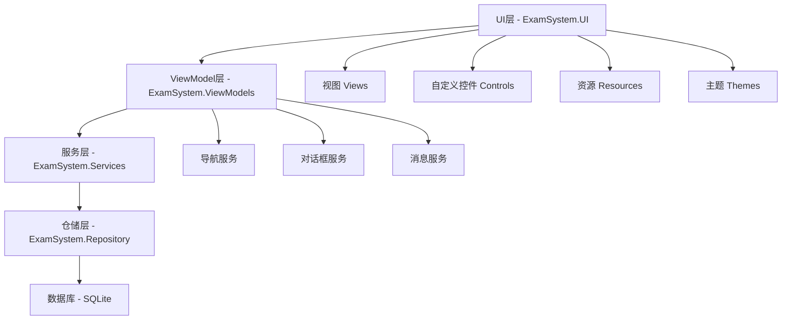

### 2.2 MVVM 模式实现

#### 2.2.1 View 职责
- 定义 XAML 用户界面布局
- 数据绑定到 ViewModel 属性
- 不包含业务逻辑
- 通过依赖注入获取对应的 ViewModel

#### 2.2.2 ViewModel 职责
- 继承 ObservableObject 实现属性通知
- 使用 RelayCommand 和 AsyncRelayCommand 处理用户交互
- 调用服务层执行业务逻辑
- 管理视图状态和数据验证
- 通过导航服务控制页面跳转

#### 2.2.3 数据流向

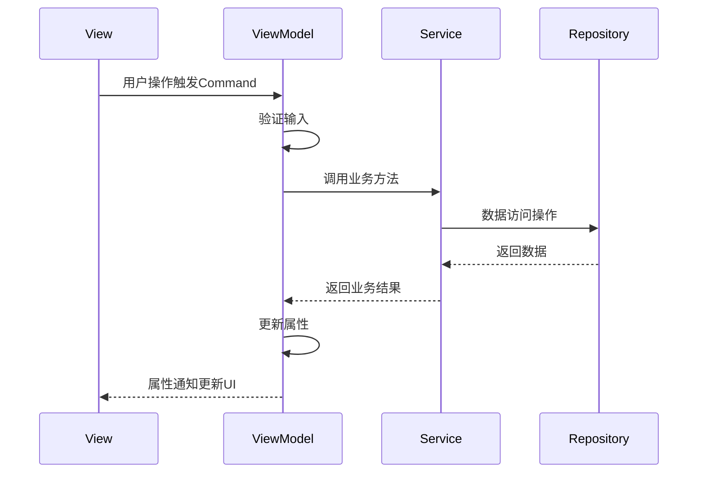

## 3. 窗口与页面架构

### 3.1 应用程序入口

#### App.xaml 职责
- 配置依赖注入容器
- 注册服务、仓储、ViewModel
- 配置数据库上下文
- 初始化日志系统
- 定义全局资源和主题
- 处理全局异常

#### 启动流程

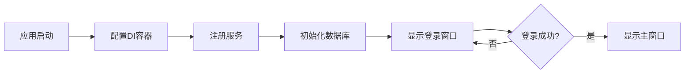

### 3.2 窗口结构

| 窗口名称 | 用途 | ViewModel |
|---------|------|-----------|
| LoginWindow | 用户登录 | LoginViewModel |
| MainWindow | 主界面框架 | MainViewModel |
| SplashWindow | 启动欢迎页 | SplashViewModel |

### 3.3 主窗口布局设计

主窗口采用左侧导航 + 右侧内容区域的经典布局结构：

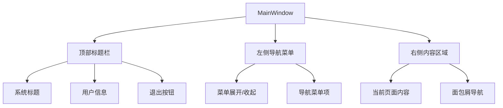

#### 主窗口组成部分

| 区域 | 描述 | 宽度/高度 |
|------|------|----------|
| 顶部标题栏 | 显示系统名称、用户信息、快捷操作 | 高度 60px |
| 左侧导航 | 展开状态显示菜单图标和文字，收起状态仅显示图标 | 展开 220px / 收起 60px |
| 内容区域 | 动态加载不同页面的 UserControl | 自适应 |

## 4. 页面设计

### 4.1 公共页面

#### 4.1.1 登录页面 (LoginView)

**功能描述**：用户身份验证入口

**UI元素**：
- 用户名输入框
- 密码输入框（密码可见切换）
- 记住密码复选框
- 登录按钮
- 错误提示区域
- 加载指示器

**ViewModel**: LoginViewModel (已实现)

**交互流程**：

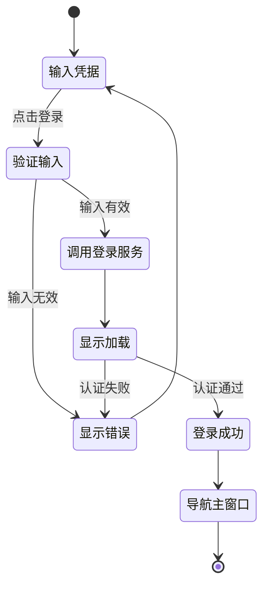

#### 4.1.2 主页面 (HomeView)

**功能描述**：展示系统概览和快捷入口

**UI元素（根据角色显示）**：

| 角色 | 显示内容 |
|------|---------|
| 管理员 | 系统统计卡片（用户数、题库数、试卷数、考试数）、最近活动、快捷操作 |
| 教师 | 我的题库、我的试卷、待评阅考试、最近考试统计 |
| 学生 | 待参加考试、已完成考试、我的成绩、错题统计 |

**ViewModel**: HomeViewModel

**数据需求**：
- 调用统计服务获取概览数据
- 根据当前用户角色过滤显示内容

### 4.2 管理员页面

#### 4.2.1 用户管理页面 (UserManagementView)

**功能描述**：管理系统用户（增删改查）

**UI布局**：

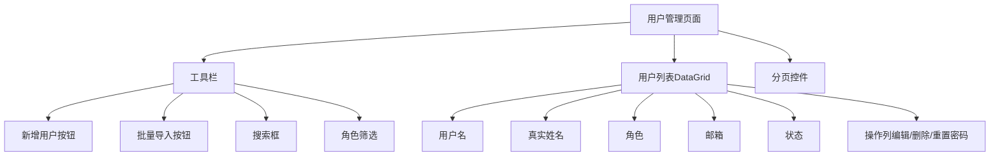

**ViewModel**: UserManagementViewModel

**核心属性**：
- Users (ObservableCollection): 用户列表
- SelectedUser: 当前选中用户
- SearchKeyword: 搜索关键字
- SelectedRole: 筛选角色
- CurrentPage, PageSize, TotalCount: 分页参数

**核心命令**：
- AddUserCommand: 打开新增用户对话框
- EditUserCommand: 编辑选中用户
- DeleteUserCommand: 删除用户（需确认）
- ResetPasswordCommand: 重置用户密码
- ImportUsersCommand: 批量导入用户
- SearchCommand: 执行搜索

#### 4.2.2 系统设置页面 (SystemSettingsView)

**功能描述**：配置系统参数

**配置项**：
- 数据库设置（备份、还原）
- 考试默认设置（默认时长、及格分数）
- 安全设置（密码策略、会话超时）
- 日志设置（日志级别、保留天数）

**ViewModel**: SystemSettingsViewModel

### 4.3 教师/管理员共用页面

#### 4.3.1 题库管理页面 (QuestionBankView)

**功能描述**：管理题库和题目

**UI布局（左右分栏）**：

| 左侧（30%） | 右侧（70%） |
|------------|-----------|
| 题库列表树形结构 | 题目列表 + 工具栏 |
| 新增题库按钮 | 新增题目、导入、导出按钮 |
| 题库操作（编辑、删除） | 题目筛选（题型、难度） |

**ViewModel**: QuestionBankViewModel

**核心属性**：
- QuestionBanks (ObservableCollection): 题库列表
- SelectedBank: 当前选中题库
- Questions (ObservableCollection): 题目列表
- QuestionTypeFilter: 题型筛选
- DifficultyFilter: 难度筛选

**核心命令**：
- AddBankCommand: 新增题库
- EditBankCommand: 编辑题库
- DeleteBankCommand: 删除题库
- AddQuestionCommand: 新增题目
- EditQuestionCommand: 编辑题目
- DeleteQuestionCommand: 删除题目
- ImportQuestionsCommand: 导入题目
- ExportQuestionsCommand: 导出题目
- LoadQuestionsCommand: 加载题库题目

#### 4.3.2 题目编辑对话框 (QuestionEditorDialog)

**功能描述**：创建或编辑题目

**UI元素（根据题型动态显示）**：

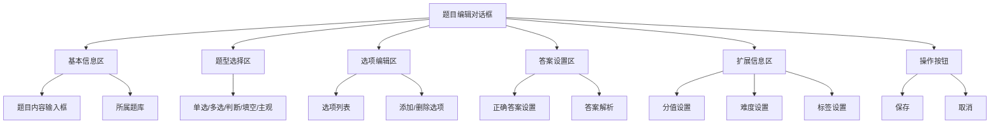

**ViewModel**: QuestionEditorViewModel

**验证逻辑**：
- 题目内容不能为空
- 单选/多选至少包含2个选项
- 必须设置正确答案
- 分值必须大于0

#### 4.3.3 试卷管理页面 (ExamPaperView)

**功能描述**：创建、编辑、管理试卷

**UI布局**：

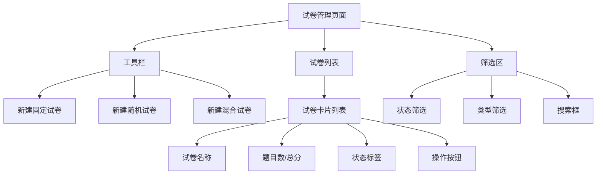

**ViewModel**: ExamPaperViewModel

**核心命令**：
- CreateFixedPaperCommand: 创建固定试卷
- CreateRandomPaperCommand: 创建随机试卷
- CreateMixedPaperCommand: 创建混合试卷
- EditPaperCommand: 编辑试卷
- DeletePaperCommand: 删除试卷
- PreviewPaperCommand: 预览试卷
- ActivatePaperCommand: 激活试卷
- ArchivePaperCommand: 归档试卷
- DuplicatePaperCommand: 复制试卷

#### 4.3.4 组卷向导 (PaperCreationWizard)

**功能描述**：分步骤引导创建试卷

**步骤流程**：

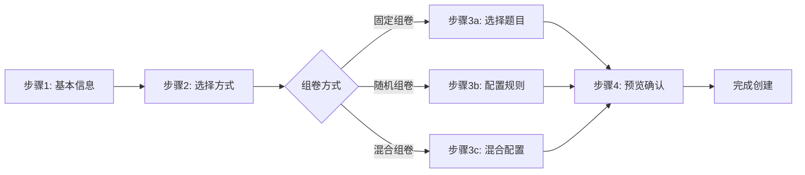

**步骤1 - 基本信息**：
- 试卷名称
- 试卷描述
- 总分
- 及格分
- 考试时长
- 开始时间和结束时间

**步骤2 - 选择组卷方式**：
- 固定组卷：手动选择题目
- 随机组卷：设置抽题规则
- 混合组卷：部分固定 + 部分随机

**步骤3a - 固定组卷题目选择**：
- 从题库中选择题目
- 设置每题分值
- 调整题目顺序

**步骤3b - 随机组卷规则**：

| 配置项 | 说明 |
|-------|------|
| 题库选择 | 选择一个或多个题库 |
| 题型配置 | 每种题型抽取数量和分值 |
| 难度配置 | 简单/中等/困难题目比例 |
| 标签过滤 | 按标签筛选题目 |

**步骤3c - 混合组卷配置**：
- 固定题目部分：手动选择
- 随机题目部分：配置规则

**步骤4 - 预览确认**：
- 显示试卷完整信息
- 题目列表预览
- 确认并保存

**ViewModel**: PaperCreationWizardViewModel

#### 4.3.5 考试监控页面 (ExamMonitorView)

**功能描述**：实时监控正在进行的考试

**UI元素**：

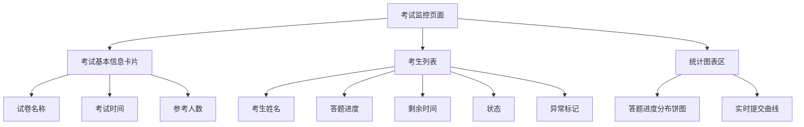

**ViewModel**: ExamMonitorViewModel

**实时数据更新**：
- 使用定时器每30秒刷新考试进度
- 考生状态实时更新（答题中、已提交、超时）

#### 4.3.6 评分管理页面 (GradingView)

**功能描述**：评阅主观题和发布成绩

**UI布局**：

| 左侧（40%） | 右侧（60%） |
|------------|-----------|
| 待评阅试卷列表 | 评阅区域 |
| 筛选：待评阅/已评阅 | 学生答案显示 |
| 显示待评阅题目数 | 评分输入 + 批注 |

**评阅流程**：

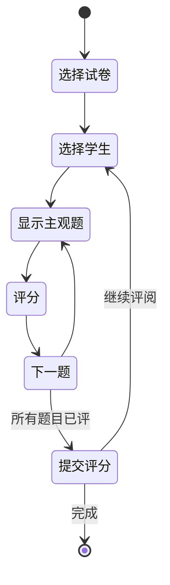

**ViewModel**: GradingViewModel

**核心命令**：
- LoadExamRecordsCommand: 加载考试记录
- SelectRecordCommand: 选择待评阅记录
- SubmitScoreCommand: 提交评分
- NextQuestionCommand: 下一题
- PreviousQuestionCommand: 上一题
- PublishResultsCommand: 发布成绩

#### 4.3.7 统计分析页面 (StatisticsView)

**功能描述**：多维度数据统计和可视化

**统计维度**：

| 统计类型 | 可视化方式 | 数据来源 |
|---------|-----------|---------|
| 试卷统计 | 柱状图、饼图 | PaperStatistics |
| 成绩分布 | 正态分布曲线 | 考试记录 |
| 题目质量分析 | 表格 + 图表 | QuestionAnalysis |
| 班级排名 | 排行榜 | StudentRanking |

**试卷统计指标**：
- 参考人数
- 平均分
- 最高分/最低分
- 及格率
- 优秀率
- 分数段分布

**题目分析指标**：
- 答对率
- 区分度
- 难度系数
- 选项分布（选择题）

**ViewModel**: StatisticsViewModel

### 4.4 学生页面

#### 4.4.1 考试列表页面 (ExamListView)

**功能描述**：显示学生可参加的考试

**UI布局**：

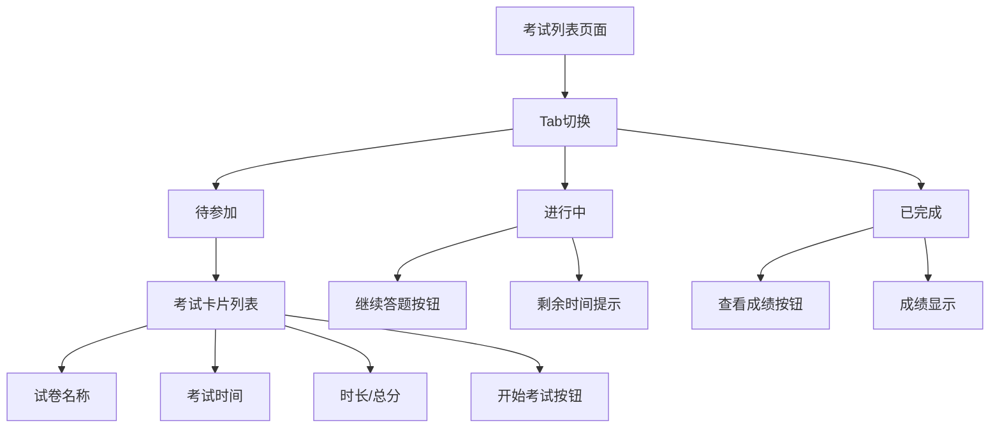

**ViewModel**: ExamListViewModel

**核心命令**：
- LoadExamsCommand: 加载考试列表
- StartExamCommand: 开始考试
- ResumeExamCommand: 继续考试
- ViewResultCommand: 查看成绩

#### 4.4.2 答题页面 (ExamTakingView)

**功能描述**：学生在线答题界面

**UI布局**：

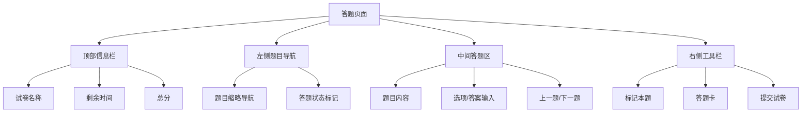

**答题卡设计**：

| 状态 | 颜色标识 | 说明 |
|------|---------|------|
| 未答 | 灰色 | 题目未作答 |
| 已答 | 蓝色 | 题目已作答 |
| 已标记 | 橙色 | 标记待检查 |
| 当前题 | 高亮边框 | 正在作答 |

**自动保存机制**：
- 答案输入后5秒自动保存
- 切换题目时自动保存
- 定时每分钟自动保存

**交互流程**：

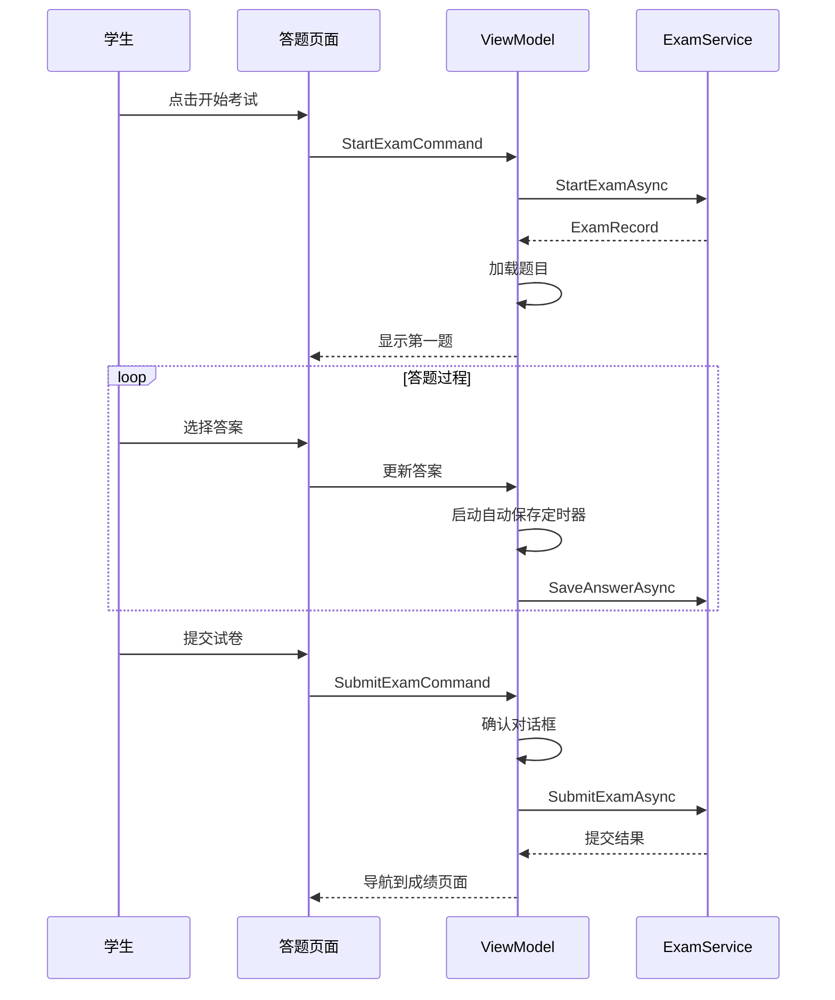

**ViewModel**: ExamTakingViewModel

**核心属性**：
- ExamRecord: 当前考试记录
- Questions: 题目列表
- CurrentQuestionIndex: 当前题目索引
- RemainingTime: 剩余时间
- Answers: 学生答案字典
- MarkedQuestions: 标记的题目集合

**核心命令**：
- NextQuestionCommand: 下一题
- PreviousQuestionCommand: 上一题
- JumpToQuestionCommand: 跳转到指定题目
- MarkQuestionCommand: 标记题目
- SubmitExamCommand: 提交考试
- SaveAnswerCommand: 保存答案

**倒计时功能**：
- 使用 DispatcherTimer 每秒更新剩余时间
- 剩余5分钟时显示警告提示
- 时间到达自动提交试卷

#### 4.4.3 成绩查看页面 (ScoreView)

**功能描述**：查看考试成绩和答题详情

**UI元素**：

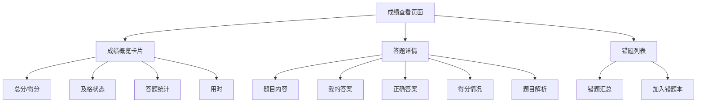

**ViewModel**: ScoreViewModel

#### 4.4.4 错题本页面 (WrongQuestionView)

**功能描述**：管理错题，支持错题复习

**功能特性**：
- 按科目/题型分类显示错题
- 显示错题次数统计
- 错题练习模式
- 移除已掌握错题

**ViewModel**: WrongQuestionViewModel

## 5. 自定义控件设计

### 5.1 通用控件

#### 5.1.1 题目显示控件 (QuestionDisplay)

**用途**：统一的题目展示组件，根据题型自适应渲染

**依赖属性**：
- Question: 题目实体
- ShowAnswer: 是否显示答案
- IsReadOnly: 是否只读
- SelectedAnswer: 选中答案（双向绑定）

**模板选择器**：
- SingleChoiceTemplate: 单选题模板
- MultipleChoiceTemplate: 多选题模板
- JudgmentTemplate: 判断题模板
- FillBlankTemplate: 填空题模板
- SubjectiveTemplate: 主观题模板

#### 5.1.2 分页控件 (PaginationControl)

**用途**：通用分页导航组件

**依赖属性**：
- CurrentPage: 当前页码
- TotalPages: 总页数
- PageSize: 每页条数
- TotalCount: 总记录数

**事件**：
- PageChangedEvent: 页码改变事件

#### 5.1.3 统计卡片 (StatisticCard)

**用途**：首页统计数据展示卡片

**依赖属性**：
- Title: 卡片标题
- Value: 数值
- Icon: 图标
- TrendValue: 趋势值
- TrendDirection: 上升/下降

#### 5.1.4 倒计时控件 (CountdownTimer)

**用途**：考试倒计时显示

**依赖属性**：
- RemainingSeconds: 剩余秒数
- WarningThreshold: 警告阈值（秒）
- ShowProgressRing: 是否显示进度环

**事件**：
- TimeUpEvent: 时间到达事件
- WarningEvent: 接近警告阈值事件

### 5.2 图表控件（基于 LiveCharts）

#### 5.2.1 成绩分布图 (ScoreDistributionChart)

**图表类型**：柱状图

**数据输入**：分数段及对应人数

#### 5.2.2 答题进度饼图 (ProgressPieChart)

**图表类型**：饼图

**数据输入**：已答/未答题目数量

## 6. 服务设计

### 6.1 导航服务 (INavigationService)

**职责**：管理页面导航和 ViewModel 切换

**方法定义**：

| 方法名 | 参数 | 返回值 | 说明 |
|-------|------|-------|------|
| NavigateTo | viewModelType | void | 导航到指定 ViewModel |
| NavigateToWithParameter | viewModelType, parameter | void | 带参数导航 |
| GoBack | - | void | 返回上一页 |
| CanGoBack | - | bool | 是否可以返回 |

**实现机制**：
- 维护导航堆栈
- 通过 DI 容器创建 ViewModel 实例
- 触发主窗口的 CurrentViewModel 属性更新

### 6.2 对话框服务 (IDialogService)

**职责**：统一管理对话框和消息弹窗

**方法定义**：

| 方法名 | 参数 | 返回值 | 说明 |
|-------|------|-------|------|
| ShowMessageAsync | title, message | Task | 显示消息对话框 |
| ShowConfirmAsync | title, message | Task\<bool\> | 显示确认对话框 |
| ShowErrorAsync | title, error | Task | 显示错误对话框 |
| ShowInputDialogAsync | title, prompt | Task\<string\> | 显示输入对话框 |
| ShowCustomDialogAsync | viewModel | Task\<bool\> | 显示自定义对话框 |

### 6.3 消息通知服务 (INotificationService)

**职责**：应用内消息通知（非阻塞）

**方法定义**：

| 方法名 | 参数 | 说明 |
|-------|------|------|
| ShowSuccess | message | 显示成功提示 |
| ShowWarning | message | 显示警告提示 |
| ShowError | message | 显示错误提示 |
| ShowInfo | message | 显示信息提示 |

**显示位置**：主窗口右上角弹出式通知，3秒后自动消失

### 6.4 文件对话框服务 (IFileDialogService)

**职责**：文件选择和保存对话框

**方法定义**：

| 方法名 | 参数 | 返回值 | 说明 |
|-------|------|-------|------|
| ShowOpenFileDialog | filter | string | 打开文件选择 |
| ShowSaveFileDialog | filter, defaultFileName | string | 保存文件对话框 |
| ShowFolderBrowserDialog | - | string | 文件夹选择 |

## 7. 主题与样式设计

### 7.1 颜色方案

**主色调**：

| 用途 | 颜色代码 | 说明 |
|------|---------|------|
| Primary | #1976D2 | 主色（蓝色） |
| Secondary | #FFC107 | 辅助色（琥珀色） |
| Success | #4CAF50 | 成功（绿色） |
| Warning | #FF9800 | 警告（橙色） |
| Error | #F44336 | 错误（红色） |
| Info | #2196F3 | 信息（浅蓝） |

**中性色**：

| 用途 | 颜色代码 |
|------|---------|
| Background | #FAFAFA |
| Surface | #FFFFFF |
| Border | #E0E0E0 |
| TextPrimary | #212121 |
| TextSecondary | #757575 |
| Disabled | #BDBDBD |

### 7.2 样式资源组织

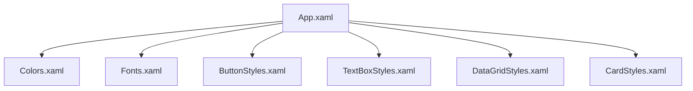

**资源字典分类**：

| 文件名 | 内容 |
|-------|------|
| Colors.xaml | 颜色定义 |
| Fonts.xaml | 字体大小、字重 |
| ButtonStyles.xaml | 按钮样式（主按钮、次按钮、图标按钮） |
| TextBoxStyles.xaml | 输入框样式 |
| DataGridStyles.xaml | 数据表格样式 |
| CardStyles.xaml | 卡片容器样式 |
| DialogStyles.xaml | 对话框样式 |

### 7.3 响应式设计

**窗口最小尺寸**：1280 x 720

**断点设计**：

| 断点名称 | 宽度范围 | 调整策略 |
|---------|---------|---------|
| Normal | >= 1280px | 默认布局 |
| Compact | 1024-1279px | 缩小间距，隐藏部分辅助信息 |

## 8. 状态管理

### 8.1 应用程序状态

**全局状态（存储在 MainViewModel）**：
- CurrentUser: 当前登录用户信息
- UserRole: 用户角色
- Permissions: 用户权限列表

**会话状态**：
- IsAuthenticated: 是否已认证
- SessionTimeout: 会话超时时间

### 8.2 页面状态

**通用状态属性**（每个 ViewModel）：
- IsLoading: 加载状态
- ErrorMessage: 错误消息
- ValidationErrors: 验证错误集合

### 8.3 考试状态持久化

**场景**：学生考试过程中应用意外关闭

**解决方案**：
- 答案自动保存到数据库（AnswerRecord）
- 重新启动时检测未完成考试
- 提示恢复考试

**恢复流程**：

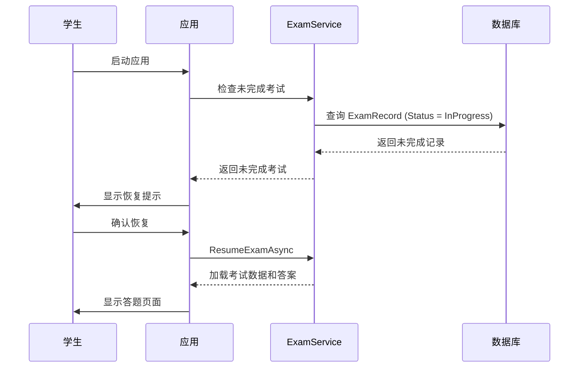

## 9. 数据绑定与验证

### 9.1 数据绑定模式

**属性绑定规则**：

| 场景 | 绑定模式 | 说明 |
|------|---------|------|
| 只读数据展示 | OneWay | ViewModel → View |
| 用户输入 | TwoWay | View ↔ ViewModel |
| 命令绑定 | OneWay | Command |

### 9.2 输入验证

**验证方式**：实现 INotifyDataErrorInfo 接口

**常见验证规则**：

| 字段类型 | 验证规则 |
|---------|---------|
| 用户名 | 必填，3-20字符，字母数字 |
| 密码 | 必填，6-20字符 |
| 邮箱 | 必填，邮箱格式 |
| 分数 | 必填，数字，0-总分 |
| 题目内容 | 必填，最大5000字符 |

**验证触发时机**：
- 失去焦点时验证
- 提交表单时统一验证
- 实时验证（特殊场景）

### 9.3 错误显示

**错误提示位置**：
- 输入框下方显示验证错误文本
- 输入框边框变红色
- 提交按钮根据整体验证状态启用/禁用

## 10. 性能优化策略

### 10.1 数据虚拟化

**应用场景**：题目列表、用户列表等大数据量展示

**实现方式**：
- DataGrid 启用 VirtualizingPanel
- 使用分页加载数据
- 延迟加载图片和富文本内容

### 10.2 异步加载

**原则**：所有数据访问和 I/O 操作使用异步方法

**AsyncRelayCommand 使用**：
- 自动管理 IsLoading 状态
- 捕获异常并显示错误信息
- 防止重复执行

### 10.3 缓存机制

**缓存策略**：

| 数据类型 | 缓存位置 | 失效策略 |
|---------|---------|---------|
| 用户信息 | ViewModel 内存 | 退出登录清除 |
| 题库列表 | 静态缓存 | 手动刷新或5分钟过期 |
| 题目数据 | ViewModel 内存 | 页面关闭清除 |

### 10.4 UI 线程优化

**避免 UI 线程阻塞**：
- 复杂计算使用 Task.Run 后台执行
- 使用 Dispatcher.InvokeAsync 更新 UI
- 大数据集合操作分批处理

## 11. 异常处理

### 11.1 全局异常处理

**位置**：App.xaml.cs

**处理策略**：
- 捕获 DispatcherUnhandledException
- 记录日志到文件
- 显示友好错误提示
- 提供错误报告选项

### 11.2 ViewModel 异常处理

**模式**：

```
异步命令执行流程：
1. 设置 IsLoading = true
2. 清除之前的 ErrorMessage
3. try {
     执行业务逻辑
   } catch (Exception ex) {
     记录日志
     设置 ErrorMessage
     显示错误通知
   } finally {
     设置 IsLoading = false
   }
```

### 11.3 网络和数据库异常

**常见异常及处理**：

| 异常类型 | 用户提示 | 日志级别 |
|---------|---------|---------|
| 数据库连接失败 | "数据库连接失败，请检查配置" | Error |
| 数据验证失败 | 显示具体验证错误 | Warning |
| 业务逻辑异常 | 显示业务错误消息 | Warning |
| 未知异常 | "系统错误，请联系管理员" | Error |

## 12. 安全性设计

### 12.1 密码安全

**策略**：
- 密码输入框使用 PasswordBox 控件
- 不在内存中明文存储密码
- 传输前使用 PasswordHelper 哈希处理

### 12.2 权限控制

**实现方式**：

**方式1：基于角色的 UI 元素可见性**
- 使用 Converter 根据 UserRole 控制 Visibility
- 菜单项根据角色过滤

**方式2：命令执行前验证权限**
- Command 的 CanExecute 检查用户权限
- 服务层二次验证

**权限矩阵**：

| 功能 | 管理员 | 教师 | 学生 |
|-----|-------|------|------|
| 用户管理 | ✓ | ✗ | ✗ |
| 题库管理 | ✓ | ✓ | ✗ |
| 试卷管理 | ✓ | ✓ | ✗ |
| 参加考试 | ✗ | ✗ | ✓ |
| 评分管理 | ✓ | ✓ | ✗ |
| 统计分析 | ✓ | ✓ | ✗ |
| 查看成绩 | ✓ | ✓ | ✓ |

### 12.3 会话管理

**超时机制**：
- 无操作30分钟自动退出登录
- 使用 DispatcherTimer 监测用户活动
- 超时前1分钟显示续期提示

## 13. 日志与诊断

### 13.1 日志记录

**使用 Serilog 记录以下信息**：

| 日志级别 | 记录内容 | 示例 |
|---------|---------|------|
| Debug | 调试信息 | "导航到 QuestionBankView" |
| Information | 用户操作 | "用户 [username] 登录成功" |
| Warning | 业务警告 | "题目验证失败: 缺少正确答案" |
| Error | 异常错误 | "数据库操作失败: [详细信息]" |
| Fatal | 致命错误 | "应用程序崩溃" |

**日志输出位置**：
- 文件：Logs/exam-system-.txt（按日期滚动）
- 控制台：开发模式

### 13.2 性能监控

**监控指标**：
- 页面加载时间
- 数据查询耗时
- 考试提交响应时间

**实现方式**：
- 使用 Stopwatch 测量关键操作耗时
- 记录到日志以供分析

## 14. 国际化与本地化

**当前版本**：仅支持中文

**预留扩展**：
- 使用资源文件 (.resx) 存储文本
- 关键字符串使用资源引用而非硬编码
- UI 布局考虑不同语言文本长度差异

## 15. 辅助功能

**键盘导航**：
- 所有可交互控件支持 Tab 键导航
- 设置合理的 TabIndex

**快捷键**：

| 快捷键 | 功能 |
|-------|------|
| Ctrl+S | 保存 |
| Ctrl+N | 新建 |
| Ctrl+F | 搜索 |
| Esc | 关闭对话框 |
| F5 | 刷新 |

## 16. 单元测试策略

### 16.1 ViewModel 测试

**测试重点**：
- 属性变更通知
- 命令执行逻辑
- 验证逻辑
- 与 Service 的交互（使用 Mock）

**测试框架**：xUnit + Moq

**示例测试用例**：

测试场景：LoginViewModel 登录成功
- 准备：Mock IUserService 返回成功结果
- 执行：调用 LoginCommand
- 验证：LoginResult 不为空，ErrorMessage 为空

### 16.2 自定义控件测试

**测试内容**：
- 依赖属性默认值
- 属性变更触发事件
- 模板应用正确性

## 17. 部署与打包

### 17.1 发布配置

**发布模式**：
- 配置：Release
- 目标运行时：win-x64
- 部署模式：Framework-dependent（依赖框架）或 Self-contained（独立部署）

### 17.2 安装程序

**打包工具选项**：
- WiX Toolset
- Inno Setup
- ClickOnce（适用于企业内部）

**安装包内容**：
- 应用程序文件
- .NET 5.0 Runtime（Self-contained 模式）
- 配置文件模板
- 用户手册

### 17.3 配置管理

**appsettings.json 配置项**：

| 配置项 | 说明 | 示例值 |
|-------|------|-------|
| ConnectionStrings:DefaultConnection | 数据库连接字符串 | "Data Source=exam.db" |
| Logging:LogLevel:Default | 默认日志级别 | "Information" |
| Application:SessionTimeout | 会话超时（分钟） | 30 |
| Application:AutoSaveInterval | 自动保存间隔（秒） | 60 |

## 18. ViewModel 清单

| ViewModel | 对应 View | 主要功能 | 依赖服务 |
|-----------|-----------|---------|---------|
| LoginViewModel | LoginView | 用户登录 | IUserService |
| MainViewModel | MainWindow | 主窗口框架 | INavigationService |
| HomeViewModel | HomeView | 首页概览 | IStatisticsService |
| UserManagementViewModel | UserManagementView | 用户管理 | IUserService |
| QuestionBankViewModel | QuestionBankView | 题库管理 | IQuestionService |
| QuestionEditorViewModel | QuestionEditorDialog | 题目编辑 | IQuestionService |
| ExamPaperViewModel | ExamPaperView | 试卷管理 | IExamPaperService |
| PaperCreationWizardViewModel | PaperCreationWizard | 组卷向导 | IExamPaperService, IQuestionService |
| ExamMonitorViewModel | ExamMonitorView | 考试监控 | IExamService, IStatisticsService |
| GradingViewModel | GradingView | 评分管理 | IGradingService |
| StatisticsViewModel | StatisticsView | 统计分析 | IStatisticsService |
| ExamListViewModel | ExamListView | 考试列表 | IExamPaperService, IExamService |
| ExamTakingViewModel | ExamTakingView | 在线答题 | IExamService |
| ScoreViewModel | ScoreView | 成绩查看 | IExamService, IGradingService |
| WrongQuestionViewModel | WrongQuestionView | 错题本 | IStatisticsService |
| SystemSettingsViewModel | SystemSettingsView | 系统设置 | - |

## 19. 依赖注入配置

### 19.1 服务注册

**生命周期策略**：

| 服务类型 | 生命周期 | 原因 |
|---------|---------|------|
| IUserService | Scoped | 可能包含用户上下文 |
| IQuestionService | Scoped | 数据库操作 |
| IExamPaperService | Scoped | 数据库操作 |
| IExamService | Scoped | 数据库操作 |
| IGradingService | Scoped | 数据库操作 |
| IStatisticsService | Scoped | 数据库操作 |
| INavigationService | Singleton | 全局导航状态 |
| IDialogService | Singleton | UI 服务 |
| INotificationService | Singleton | UI 服务 |
| ViewModels | Transient | 每次导航创建新实例 |

### 19.2 配置示例结构

配置容器的职责：
1. 注册 DbContext
2. 注册所有 Repository
3. 注册所有 Service
4. 注册所有 ViewModel
5. 注册 UI 服务（Navigation, Dialog, Notification）
6. 配置日志
7. 配置选项模式读取 appsettings.json
