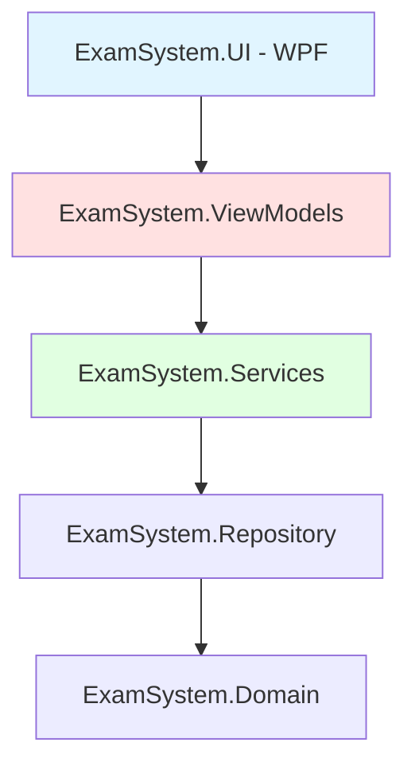
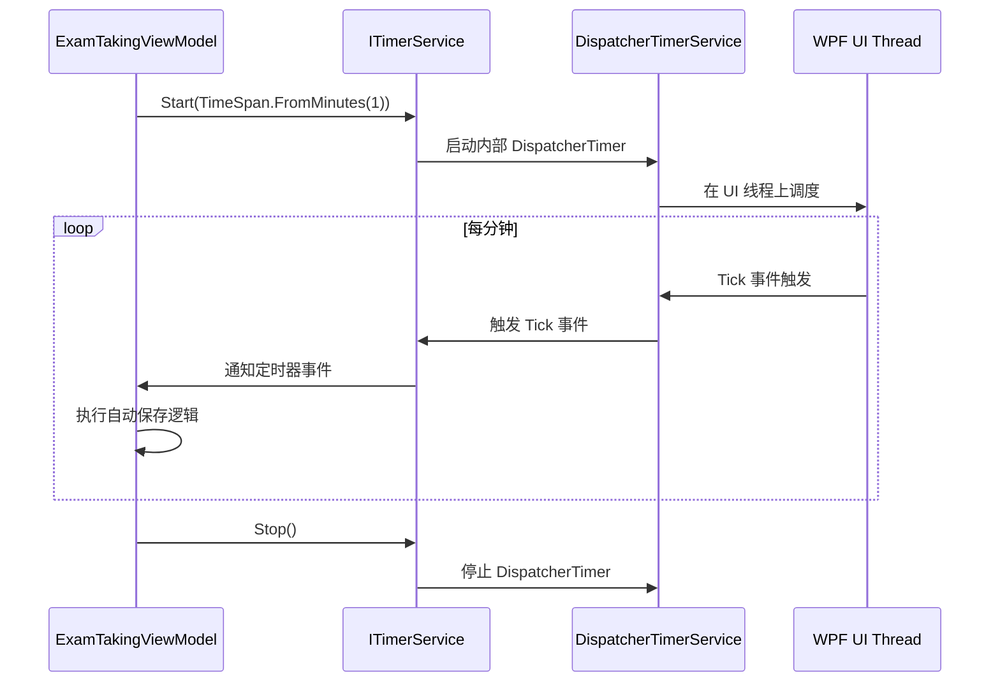
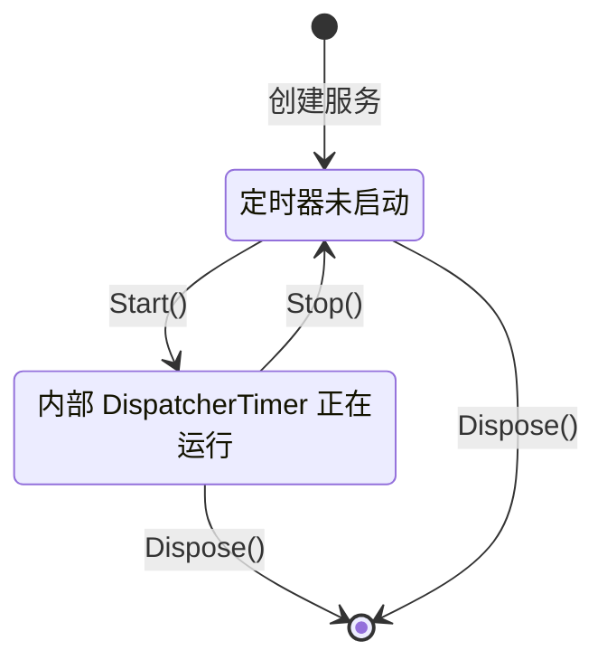
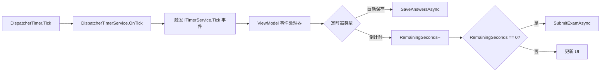
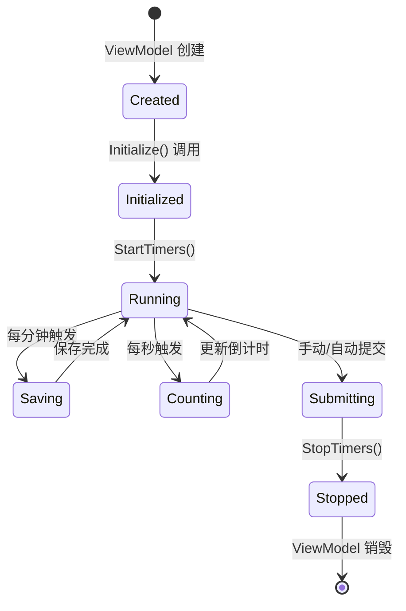

# DispatcherTimer 引用错误修复设计

## 概述

### 问题描述
`ExamTakingViewModel` 类位于 `ExamSystem.ViewModels` 项目中，该类使用了 `DispatcherTimer` 类型，但 `ExamSystem.ViewModels` 项目是一个纯 .NET 5.0 项目（`net5.0-windows`），未引用 WPF 框架程序集，导致 `DispatcherTimer` 无法解析。

### 根本原因
- **架构违背**: ViewModel 层不应直接依赖 UI 框架特定类型（如 `DispatcherTimer`）
- **MVVM 原则违反**: ViewModel 应保持对 UI 框架的无感知，以便于测试和跨平台复用
- **依赖缺失**: `ExamSystem.ViewModels.csproj` 缺少对 `PresentationFramework` 和 `WindowsBase` 的引用

### 影响范围
- 编译失败：`ExamTakingViewModel.cs` 无法通过编译
- 架构退化：引入 UI 框架依赖会降低 ViewModel 的可测试性
- 代码质量：违背 MVVM 模式的最佳实践

## 架构分析

### 当前分层结构

### 问题示意

| 项目 | 目标框架 | WPF 引用 | 问题 |
|------|---------|---------|------|
| ExamSystem.ViewModels | net5.0-windows | ❌ 无 | 无法使用 DispatcherTimer |
| ExamSystem.UI | net5.0-windows | ✅ 有 | 可正常使用 DispatcherTimer |

### 职责冲突分析

**DispatcherTimer 的本质**：
- 属于 `System.Windows.Threading` 命名空间
- 是 WPF UI 线程调度器的一部分
- 与 UI 框架紧密耦合

**ViewModel 的职责**：
- 管理业务逻辑和状态
- 提供数据绑定属性
- 不应依赖具体 UI 框架

## 解决方案设计

### 方案一：使用抽象定时器服务（推荐）

#### 设计思路
将定时器功能抽象为服务接口，ViewModel 依赖接口而非具体实现，由 UI 层提供 WPF 特定的实现。

#### 接口定义

| 接口 | 位置 | 职责 |
|------|------|------|
| ITimerService | ExamSystem.Abstractions | 定义定时器抽象契约 |
| DispatcherTimerService | ExamSystem.UI | 基于 DispatcherTimer 的实现 |

#### 接口契约

**ITimerService 接口成员**：

| 成员 | 类型 | 说明 |
|------|------|------|
| Start | 方法 | 启动定时器，参数：间隔时间 |
| Stop | 方法 | 停止定时器 |
| IsRunning | 属性 | 获取定时器运行状态 |
| Tick | 事件 | 定时器触发事件 |

#### 交互流程

#### 依赖注入配置

**服务注册位置**：`ExamSystem.UI/App.xaml.cs`

| 服务接口 | 实现类 | 生命周期 | 说明 |
|---------|--------|---------|------|
| ITimerService | DispatcherTimerService | Transient | 每次注入创建新实例 |

#### ViewModel 改造

**ExamTakingViewModel 更新点**：

| 原实现 | 新实现 | 变更原因 |
|--------|--------|---------|
| `DispatcherTimer _autoSaveTimer` | `ITimerService _autoSaveTimer` | 依赖抽象而非具体类型 |
| `DispatcherTimer _countdownTimer` | `ITimerService _countdownTimer` | 同上 |
| `new DispatcherTimer { Interval = ... }` | `_autoSaveTimer.Start(TimeSpan.FromMinutes(1))` | 通过服务接口操作 |

#### 优势分析

| 优势项 | 说明 |
|--------|------|
| 架构清晰 | ViewModel 不依赖 UI 框架 |
| 易于测试 | 可注入 Mock ITimerService |
| 跨平台潜力 | 可为不同 UI 框架提供不同实现 |
| 符合 SOLID | 依赖倒置原则的典型应用 |

### 方案二：添加 WPF 引用（不推荐）

#### 改动内容
在 `ExamSystem.ViewModels.csproj` 中添加 WPF 框架引用。

#### 缺点分析

| 缺点 | 影响 |
|------|------|
| 破坏分层 | ViewModel 层与 UI 框架耦合 |
| 测试困难 | 单元测试需要 WPF 运行时环境 |
| 架构退化 | 违背 MVVM 模式设计初衷 |
| 移植性差 | 无法复用到非 WPF 平台 |

### 方案三：使用 System.Timers.Timer（不推荐）

#### 问题分析
`System.Timers.Timer` 在后台线程触发事件，会导致跨线程访问 UI 问题。

#### 风险点

| 风险 | 说明 |
|------|------|
| 线程安全 | 需要手动同步到 UI 线程 |
| 复杂度增加 | 需要额外的线程调度代码 |
| 异常处理 | 跨线程异常难以捕获 |

## 实施方案（方案一）

### 步骤一：创建定时器服务接口

**文件位置**：`ExamSystem.Abstractions/Services/ITimerService.cs`

**接口职责**：
- 提供定时器启动、停止能力
- 定义定时器事件触发机制
- 管理定时器运行状态

**关键成员**：

| 成员 | 签名 | 说明 |
|------|------|------|
| Start | `void Start(TimeSpan interval)` | 启动定时器，指定触发间隔 |
| Stop | `void Stop()` | 停止定时器 |
| IsRunning | `bool IsRunning { get; }` | 获取定时器是否正在运行 |
| Tick | `event EventHandler Tick` | 定时器触发事件 |

### 步骤二：实现 WPF 版本定时器服务

**文件位置**：`ExamSystem.UI/Services/DispatcherTimerService.cs`

**实现要点**：

| 要点 | 说明 |
|------|------|
| 内部封装 | 包装 `System.Windows.Threading.DispatcherTimer` |
| 事件转发 | 将 DispatcherTimer.Tick 转发为 ITimerService.Tick |
| 状态管理 | 维护 IsRunning 属性 |
| 资源释放 | 实现 IDisposable 接口，确保定时器资源正确释放 |

**生命周期管理**：

### 步骤三：更新 ViewModel

**ExamTakingViewModel 改造清单**：

| 改造点 | 原代码特征 | 新代码特征 |
|--------|-----------|-----------|
| 字段声明 | `private DispatcherTimer? _autoSaveTimer;` | `private ITimerService? _autoSaveTimer;` |
| 字段声明 | `private DispatcherTimer? _countdownTimer;` | `private ITimerService? _countdownTimer;` |
| 构造函数 | 无 ITimerService 参数 | 注入两个 ITimerService 实例 |
| 定时器启动 | 手动创建 DispatcherTimer 实例 | 调用 ITimerService.Start() |
| 事件订阅 | `_timer.Tick += Handler;` | `_timer.Tick += Handler;` 保持不变 |
| 定时器停止 | `_timer?.Stop();` | `_timer?.Stop();` 保持不变 |

**构造函数签名变更**：

| 参数 | 类型 | 用途 |
|------|------|------|
| examService | IExamService | 已有依赖 |
| dialogService | IDialogService | 已有依赖 |
| navigationService | INavigationService | 已有依赖 |
| autoSaveTimer | ITimerService | **新增**：自动保存定时器 |
| countdownTimer | ITimerService | **新增**：倒计时定时器 |

**StartTimers 方法改造**：

| 定时器 | 原逻辑 | 新逻辑 |
|--------|--------|--------|
| 自动保存 | 创建 DispatcherTimer 对象 | 调用已注入的 _autoSaveTimer.Start() |
| 倒计时 | 创建 DispatcherTimer 对象 | 调用已注入的 _countdownTimer.Start() |

### 步骤四：配置依赖注入

**服务注册位置**：`ExamSystem.UI/App.xaml.cs` 或启动配置类

**注册示例**：

| 注册项 | 生命周期 | 说明 |
|--------|---------|------|
| `services.AddTransient<ITimerService, DispatcherTimerService>()` | Transient | 每次注入创建新实例，确保 ViewModel 间隔离 |

**ExamTakingViewModel 注册**：

当前注册方式需保留，DI 容器会自动解析 ITimerService 依赖。

### 步骤五：验证测试

**单元测试策略**：

| 测试场景 | 测试方式 | 预期结果 |
|---------|---------|---------|
| 定时器启动 | Mock ITimerService，验证 Start 调用 | Start 方法被调用，参数正确 |
| 定时器事件 | 手动触发 Mock 的 Tick 事件 | SaveAnswersAsync 被调用 |
| 定时器停止 | 调用 SubmitExamAsync | Stop 方法被调用 |
| 倒计时归零 | 模拟 RemainingSeconds 减为 0 | 自动提交试卷 |

**集成测试检查点**：

| 检查点 | 验证内容 |
|--------|---------|
| 自动保存 | 每分钟触发一次保存操作 |
| 倒计时显示 | 每秒更新 RemainingTime 属性 |
| 时间耗尽 | 自动调用 SubmitExamAsync |
| 定时器停止 | 提交试卷后两个定时器均停止 |

## 数据流分析

### 定时器事件流

### ViewModel 生命周期与定时器

## 异常处理策略

### 定时器服务异常处理

| 异常场景 | 处理策略 | 责任方 |
|---------|---------|--------|
| Start 时 DispatcherTimer 创建失败 | 捕获异常，记录日志，向上抛出 | DispatcherTimerService |
| Tick 事件处理器抛出异常 | 捕获并记录，不停止定时器 | ViewModel |
| 重复调用 Start | 先停止旧定时器再启动新的 | DispatcherTimerService |
| Dispose 后再调用 | 抛出 ObjectDisposedException | DispatcherTimerService |

### ViewModel 异常处理

| 方法 | 异常处理 |
|------|---------|
| SaveAnswersAsync | try-catch 捕获，静默失败（已有注释说明） |
| CountdownTimer_Tick | 不应抛出异常，RemainingSeconds 减操作是安全的 |
| SubmitExamAsync | 已有 try-catch，显示错误对话框 |

## 性能考量

### 定时器精度

| 定时器类型 | 精度 | 说明 |
|-----------|------|------|
| DispatcherTimer | ~15-30ms | 受 UI 线程负载影响，适合 UI 更新场景 |
| System.Timers.Timer | ~1-10ms | 更高精度，但需要线程同步 |

**推荐选择**：DispatcherTimer 足够满足分钟级自动保存和秒级倒计时需求。

### 资源管理

| 资源 | 管理方式 | 说明 |
|------|---------|------|
| DispatcherTimer 实例 | 在 DispatcherTimerService.Dispose 中释放 | 防止内存泄漏 |
| 事件订阅 | 在 Stop 或 Dispose 时取消订阅 | 避免事件处理器内存泄漏 |
| ViewModel 生命周期 | 确保页面关闭时 ViewModel 被正确销毁 | 由 DI 容器和导航框架管理 |

## 测试策略

### 单元测试

**ExamTakingViewModel 测试用例**：

| 测试用例 | 测试内容 | Mock 对象 |
|---------|---------|-----------|
| 初始化启动定时器 | Initialize 调用后两个定时器启动 | ITimerService × 2 |
| 自动保存触发 | 触发 autoSaveTimer.Tick 事件 | ITimerService, IExamService |
| 倒计时递减 | 触发 countdownTimer.Tick 事件，验证 RemainingSeconds-- | ITimerService |
| 时间耗尽自动提交 | RemainingSeconds=1 时触发 Tick，验证调用 SubmitExamAsync | 所有依赖 Mock |
| 提交停止定时器 | SubmitExamAsync 成功后验证两个 Stop 调用 | ITimerService × 2 |

**DispatcherTimerService 测试用例**：

| 测试用例 | 测试内容 | 验证点 |
|---------|---------|--------|
| Start 启动定时器 | 调用 Start，验证 IsRunning=true | 状态属性 |
| Tick 事件触发 | 模拟 DispatcherTimer.Tick，验证事件传播 | 事件订阅者被调用 |
| Stop 停止定时器 | 调用 Stop，验证 IsRunning=false | 状态属性 |
| Dispose 资源释放 | 调用 Dispose，验证内部定时器被释放 | 无异常抛出 |

### 集成测试

**ExamTakingView 集成测试**：

| 场景 | 验证内容 |
|------|---------|
| 页面加载 | 倒计时开始，时间显示正确 |
| 答题过程 | 每分钟触发自动保存（通过日志验证） |
| 倒计时警告 | 剩余时间低于阈值时 UI 显示警告 |
| 时间耗尽 | 自动提交试卷并导航回上一页 |
| 手动提交 | 定时器停止，不再触发事件 |

## 迁移清单

### 文件变更清单

| 操作 | 文件路径 | 变更内容 |
|------|---------|---------|
| 新建 | ExamSystem.Abstractions/Services/ITimerService.cs | 定时器服务接口定义 |
| 新建 | ExamSystem.UI/Services/DispatcherTimerService.cs | WPF 定时器服务实现 |
| 修改 | ExamSystem.ViewModels/ExamTakingViewModel.cs | 替换 DispatcherTimer 为 ITimerService |
| 修改 | ExamSystem.UI/App.xaml.cs | 注册 ITimerService 服务 |

### 代码移除项

| 位置 | 移除内容 |
|------|---------|
| ExamTakingViewModel.cs | `using System.Windows.Threading;`（如果存在） |
| ExamTakingViewModel.cs | `new DispatcherTimer { ... }` 对象创建代码 |

### 代码新增项

| 位置 | 新增内容 |
|------|---------|
| ExamTakingViewModel 构造函数 | 两个 ITimerService 参数 |
| StartTimers 方法 | 调用 `_autoSaveTimer.Start(interval)` |
| StopTimers 方法（建议新增） | 显式停止两个定时器的统一方法 |

## 向后兼容性

### 破坏性变更

| 变更项 | 影响 | 缓解措施 |
|--------|------|---------|
| ExamTakingViewModel 构造函数签名 | 依赖注入配置需更新 | 更新 DI 容器注册代码 |
| 定时器使用方式 | 内部实现变更 | 对外接口（属性、方法）保持不变 |

### 非破坏性变更

| 变更项 | 说明 |
|--------|------|
| ITimerService 接口新增 | 新接口，不影响现有代码 |
| DispatcherTimerService 新增 | 新实现类，不影响现有代码 |

## 最佳实践建议

### ViewModel 定时器使用原则

| 原则 | 说明 |
|------|------|
| 依赖抽象 | 始终依赖 ITimerService 接口，不直接使用具体定时器类型 |
| 资源清理 | ViewModel 销毁时确保停止定时器 |
| 异常隔离 | 定时器回调中的异常不应影响定时器继续运行 |
| 线程安全 | 通过 DispatcherTimer 确保回调在 UI 线程执行 |

### 定时器服务实现原则

| 原则 | 说明 |
|------|------|
| 单一职责 | 每个 ITimerService 实例只管理一个定时器 |
| 幂等性 | 重复调用 Start/Stop 应是安全的 |
| 可释放 | 实现 IDisposable 接口 |
| 状态一致 | IsRunning 属性应准确反映定时器状态 |

### 依赖注入配置原则

| 原则 | 说明 |
|------|------|
| 使用 Transient | ITimerService 注册为 Transient，确保每个消费者独享实例 |
| 避免 Singleton | 定时器实例不应共享，避免状态冲突 |
| 命名注入（可选） | 如需区分不同用途的定时器，可使用命名注入 |

## 风险评估

| 风险项 | 可能性 | 影响 | 缓解措施 |
|--------|-------|------|---------|
| 定时器未正确停止导致内存泄漏 | 中 | 高 | 实现 IDisposable，确保 ViewModel 销毁时释放 |
| 跨线程访问 UI | 低 | 高 | 使用 DispatcherTimer 确保在 UI 线程执行 |
| 定时器精度不足 | 低 | 低 | DispatcherTimer 精度满足当前需求 |
| DI 配置错误 | 中 | 中 | 编写集成测试验证 |
| 单元测试覆盖不足 | 中 | 中 | 编写详细测试用例清单并执行 |

## 后续优化方向

### 增强功能

| 功能 | 说明 | 优先级 |
|------|------|--------|
| 定时器暂停/恢复 | 支持考试暂停场景 | 中 |
| 定时器事件携带数据 | Tick 事件传递已过去时间等信息 | 低 |
| 多平台定时器实现 | 为 Avalonia、MAUI 提供实现 | 低 |

### 代码质量

| 改进项 | 说明 |
|--------|------|
| 异步定时器 | 支持异步回调（await 友好） |
| 定时器组合 | 支持一个 ViewModel 管理多个定时器的便捷方式 |
| 诊断日志 | 定时器启动/停止/触发记录详细日志 |
