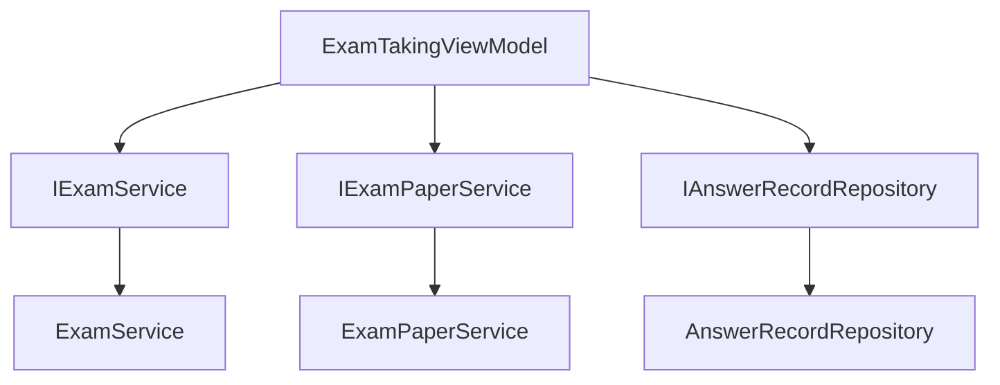
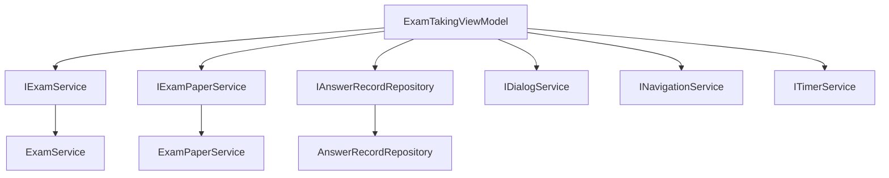

# 接口方法未实现问题解决方案

## 1. 概述

在ExamTakingViewModel中引用了IExamService接口中未定义的几个方法，导致编译错误。这些方法包括：
- `GetExamQuestionsAsync`
- `GetSavedAnswersAsync`

本设计文档旨在解决此问题，通过在适当的接口中定义和实现这些方法，确保代码的完整性和一致性。

## 2. 问题分析

### 2.1 问题描述

在ExamTakingViewModel.cs文件中，有以下方法调用：

```csharp
var questions = await _examService.GetExamQuestionsAsync(ExamRecord.ExamPaperId);
var savedAnswers = await _examService.GetSavedAnswersAsync(ExamRecord.Id);
```

然而在IExamService接口中并未定义这两个方法，导致接口与实现不一致。

### 2.2 根因分析

通过代码分析发现：
1. `GetExamQuestionsAsync`方法应该用于获取试卷的题目列表，这应该属于IExamPaperService的职责范围
2. `GetSavedAnswersAsync`方法应该用于获取已保存的答案，这应该属于IAnswerRecordRepository的职责范围

### 2.3 影响范围

- ExamTakingViewModel类无法正常编译和运行
- 服务层接口定义不完整
- 可能影响考试答题功能的正常实现

## 3. 解决方案设计

### 3.1 架构调整



### 3.2 接口方法定义

#### 3.2.1 在IExamPaperService接口中添加方法

需要在IExamPaperService接口中添加获取试卷题目的方法：

| 方法名 | 参数 | 返回值 | 说明 |
|--------|------|--------|------|
| GetExamQuestionsAsync | int paperId | Task<IEnumerable<Question>> | 获取试卷的所有题目 |

#### 3.2.2 在IAnswerRecordRepository接口中确认方法

检查IAnswerRecordRepository接口中是否已存在获取答案的方法：

| 方法名 | 参数 | 返回值 | 说明 |
|--------|------|--------|------|
| GetByExamRecordAsync | int examRecordId | Task<IEnumerable<AnswerRecord>> | 获取考试记录的所有答题记录 |

该方法已存在，可直接使用。

### 3.3 依赖注入调整

修改ExamTakingViewModel的构造函数，注入所需的额外服务：

```csharp
public ExamTakingViewModel(
    IExamService examService,
    IExamPaperService examPaperService,  // 新增
    IAnswerRecordRepository answerRecordRepository,  // 新增
    IDialogService dialogService,
    INavigationService navigationService,
    ITimerService autoSaveTimer,
    ITimerService countdownTimer)
```

### 3.4 方法实现

#### 3.4.1 在ExamPaperService中实现GetExamQuestionsAsync

在ExamPaperService中添加GetExamQuestionsAsync方法的实现：

```csharp
/// <summary>
/// 获取试卷的所有题目
/// </summary>
public async Task<IEnumerable<Question>> GetExamQuestionsAsync(int paperId)
{
    var paperQuestions = await _paperQuestionRepository.FindAsync(pq => pq.PaperId == paperId);
    var questionIds = paperQuestions.Select(pq => pq.QuestionId).ToList();
    var questions = await _questionRepository.GetManyWithOptionsAsync(questionIds);
    return questions.OrderBy(q => questionIds.IndexOf(q.QuestionId));
}
```

#### 3.4.2 在ExamTakingViewModel中调整方法调用

修改LoadQuestionsAsync方法中的服务调用：

```csharp
private async Task LoadQuestionsAsync()
{
    try
    {
        if (ExamRecord?.ExamPaper == null) return;

        var questions = await _examPaperService.GetExamQuestionsAsync(ExamRecord.ExamPaperId);
        Questions = new ObservableCollection<Question>(questions);
        
        // 加载已保存的答案
        var savedAnswers = await _answerRecordRepository.GetByExamRecordAsync(ExamRecord.Id);
        Answers = savedAnswers.ToDictionary(a => a.QuestionId, a => a.Answer);
    }
    catch (Exception ex)
    {
        await _dialogService.ShowErrorAsync("错误", $"加载题目失败: {ex.Message}");
    }
}
```

## 4. 数据模型

### 4.1 接口方法定义表

| 接口 | 方法名 | 参数 | 返回值 | 说明 |
|------|--------|------|--------|------|
| IExamPaperService | GetExamQuestionsAsync | int paperId | Task<IEnumerable<Question>> | 获取试卷的所有题目 |
| IAnswerRecordRepository | GetByExamRecordAsync | int examRecordId | Task<IEnumerable<AnswerRecord>> | 获取考试记录的所有答题记录(已存在) |

## 5. 业务逻辑层架构

### 5.1 服务依赖关系



### 5.2 方法职责划分

| 服务接口 | 方法 | 职责 |
|----------|------|------|
| IExamPaperService | GetExamQuestionsAsync | 负责试卷题目相关操作 |
| IAnswerRecordRepository | GetByExamRecordAsync | 负责答题记录相关操作 |
| IExamService | SubmitExamAsync | 负责考试流程相关操作 |

## 6. 测试策略

### 6.1 单元测试

需要为新增的方法编写单元测试：

1. **GetExamQuestionsAsync测试用例**：
   - 正常情况：返回试卷的所有题目
   - 异常情况：试卷不存在时的处理
   - 边界情况：试卷无题目时的处理

2. **ExamTakingViewModel.LoadQuestionsAsync测试用例**：
   - 正常情况：正确加载题目和答案
   - 异常情况：加载失败时的错误处理
   - 边界情况：无题目或无答案时的处理

### 6.2 集成测试

需要进行集成测试确保各组件协同工作：
1. ExamTakingViewModel与各服务的集成
2. 服务层与仓储层的集成
3. 整个考试答题流程的集成测试

## 7. 实施步骤

### 7.1 第一阶段：接口定义
1. 在IExamPaperService接口中添加GetExamQuestionsAsync方法定义
2. 确认IAnswerRecordRepository中已存在GetByExamRecordAsync方法

### 7.2 第二阶段：实现层开发
1. 在ExamPaperService中实现GetExamQuestionsAsync方法
2. 修改ExamTakingViewModel构造函数，注入新的依赖项
3. 修改ExamTakingViewModel中的方法调用

### 7.3 第三阶段：测试验证
1. 编写单元测试验证新方法的正确性
2. 进行集成测试确保功能正常
3. 验证ExamTakingViewModel的功能完整性和正确性

### 7.4 第四阶段：代码审查和优化
1. 进行代码审查确保符合编码规范
2. 优化性能和异常处理
3. 更新相关文档