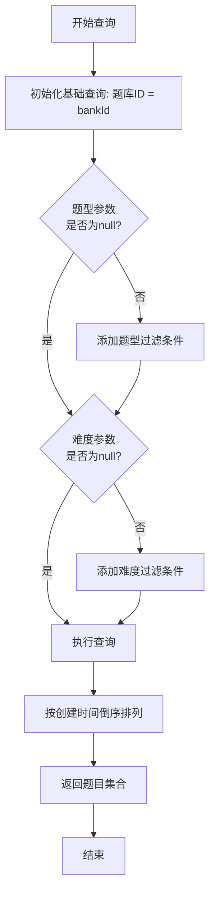
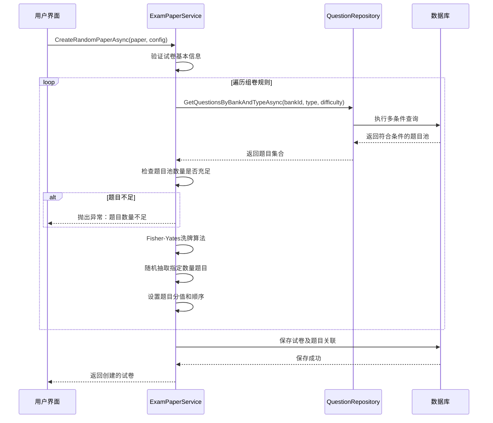
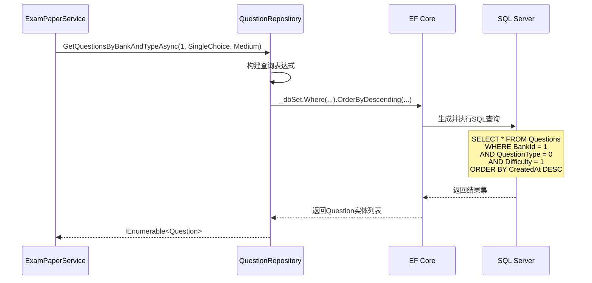
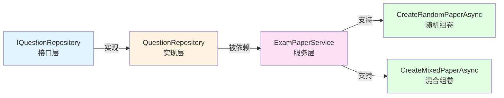

# 随机组卷题目查询方法缺失修复设计

## 1. 概述

### 1.1 问题描述
在 `ExamPaperService.cs` 的随机组卷算法实现中，调用了 `IQuestionRepository` 的 `GetQuestionsByBankAndTypeAsync` 方法，但该方法在接口定义和实现类中均不存在，导致编译失败。

具体位置：
- 文件：`ExamSystem.Services/Implementations/ExamPaperService.cs`
- 方法：`SelectQuestionsAsync`
- 调用代码：`_questionRepository.GetQuestionsByBankAndTypeAsync(config.BankId, rule.QuestionType, rule.Difficulty)`

### 1.2 影响范围
- **受影响的功能**：随机组卷、混合组卷（含随机部分）
- **受影响的服务**：`ExamPaperService`
- **受影响的仓储**：`IQuestionRepository`、`QuestionRepository`

### 1.3 修复目标
为题目仓储层补充缺失的查询方法，使随机组卷功能能够正常工作。

---

## 2. 现状分析

### 2.1 现有接口方法

`IQuestionRepository` 当前已提供的查询方法：

| 方法名称 | 参数 | 返回类型 | 用途 |
|---------|------|---------|------|
| `GetByBankIdAsync` | `int bankId` | `IEnumerable<Question>` | 按题库查询 |
| `GetByTypeAsync` | `QuestionType questionType` | `IEnumerable<Question>` | 按题型查询 |
| `GetByDifficultyAsync` | `Difficulty difficulty` | `IEnumerable<Question>` | 按难度查询 |
| `SearchQuestionsAsync` | 多个筛选参数 + 分页 | `PagedResult<Question>` | 综合搜索（支持分页） |
| `GetWithOptionsAsync` | `int questionId` | `Question` | 获取题目及选项 |
| `GetManyWithOptionsAsync` | `IEnumerable<int> questionIds` | `IEnumerable<Question>` | 批量获取题目及选项 |

### 2.2 需求分析

`SelectQuestionsAsync` 方法在随机组卷时需要：
1. 同时按题库ID、题型、难度三个维度过滤题目
2. 获取符合条件的完整题目池（非分页）
3. 用于后续的 Fisher-Yates 洗牌算法随机抽取

当前 `SearchQuestionsAsync` 虽然支持多维度查询，但返回分页结果，不适合直接用于随机抽取场景。

---

## 3. 解决方案设计

### 3.1 方案选择

#### 方案A：新增专用查询方法（推荐）
在仓储接口和实现中新增 `GetQuestionsByBankAndTypeAsync` 方法。

**优点**：
- 语义清晰，专门服务于随机组卷场景
- 不影响现有方法
- 性能优化空间大（可针对性添加索引）

**缺点**：
- 增加接口方法数量

#### 方案B：复用 SearchQuestionsAsync
通过传入极大的 pageSize 参数复用现有方法。

**优点**：
- 不增加新方法

**缺点**：
- 语义不清晰
- 返回类型包含分页信息，需要额外提取
- 性能略有损耗

**选择：方案A**，理由是语义清晰且符合单一职责原则。

---

### 3.2 接口设计

#### 3.2.1 方法签名

```
方法名称：GetQuestionsByBankAndTypeAsync

参数列表：
- bankId (int): 题库ID
- questionType (QuestionType, 可选): 题目类型
- difficulty (Difficulty, 可选): 难度级别

返回类型：Task<IEnumerable<Question>>

说明：
- questionType 为 null 时表示不限题型
- difficulty 为 null 时表示不限难度
- 返回完整题目池（非分页），用于随机抽取算法
```

#### 3.2.2 查询逻辑

查询流程如下：



#### 3.2.3 筛选条件组合矩阵

| 题库ID | 题型 | 难度 | 查询结果 |
|-------|------|------|---------|
| 必填 | 指定 | 指定 | 特定题库下特定题型和难度的题目 |
| 必填 | 指定 | null | 特定题库下特定题型的所有难度题目 |
| 必填 | null | 指定 | 特定题库下特定难度的所有题型题目 |
| 必填 | null | null | 特定题库下的所有题目 |

---

### 3.3 实现要点

#### 3.3.1 条件过滤策略
- 基础条件：题库ID（必需）
- 可选条件：题型、难度（通过参数判空动态添加）
- 过滤顺序：题库ID → 题型 → 难度（按筛选性从强到弱排序）

#### 3.3.2 排序策略
- 主排序：按创建时间降序
- 目的：优先返回新题目，保证题目池的时效性

#### 3.3.3 性能考虑
- 建议在数据库层面为 `(BankId, QuestionType, Difficulty)` 建立复合索引
- 使用 Entity Framework Core 的 IQueryable 延迟执行机制
- 避免加载不必要的导航属性

---

## 4. 数据模型

### 4.1 相关实体

#### Question 实体（简化）

| 字段名 | 类型 | 说明 |
|-------|------|------|
| QuestionId | int | 题目ID（主键） |
| BankId | int | 所属题库ID |
| QuestionType | QuestionType | 题型枚举 |
| Difficulty | Difficulty | 难度枚举 |
| Content | string | 题目内容 |
| CorrectAnswer | string | 正确答案 |
| DefaultScore | decimal | 默认分值 |
| CreatedAt | DateTime | 创建时间 |

#### QuestionType 枚举

| 枚举值 | 说明 |
|-------|------|
| SingleChoice | 单选题 |
| MultipleChoice | 多选题 |
| TrueFalse | 判断题 |
| FillInBlank | 填空题 |
| ShortAnswer | 简答题 |

#### Difficulty 枚举

| 枚举值 | 说明 |
|-------|------|
| Easy | 简单 |
| Medium | 中等 |
| Hard | 困难 |

---

## 5. 业务流程

### 5.1 随机组卷完整流程



### 5.2 查询方法调用时序



---

## 6. 接口契约

### 6.1 方法定义

**接口层面**：
```
接口：IQuestionRepository
命名空间：ExamSystem.Repository.Interfaces

方法：GetQuestionsByBankAndTypeAsync
参数：
  - int bankId: 题库ID（必填）
  - QuestionType? questionType: 题型（可选）
  - Difficulty? difficulty: 难度（可选）
返回：Task<IEnumerable<Question>>
异常：无（查询为空时返回空集合）
```

**实现层面**：
```
类：QuestionRepository
命名空间：ExamSystem.Repository.Repositories
继承：Repository<Question>
实现：IQuestionRepository

实现方法：GetQuestionsByBankAndTypeAsync
查询步骤：
  1. 从 _dbSet 创建基础查询
  2. 应用 BankId 过滤条件
  3. 如果 questionType 不为 null，应用题型过滤
  4. 如果 difficulty 不为 null，应用难度过滤
  5. 按 CreatedAt 降序排列
  6. 执行异步查询并转换为列表
返回：符合条件的题目列表（可能为空集合）
```

### 6.2 调用示例

#### 示例1：查询特定题型和难度
```
场景：查询题库1中的中等难度单选题
调用：await _questionRepository.GetQuestionsByBankAndTypeAsync(1, QuestionType.SingleChoice, Difficulty.Medium)
预期：返回题库1中所有中等难度的单选题
```

#### 示例2：仅限题型
```
场景：查询题库2中的所有多选题（不限难度）
调用：await _questionRepository.GetQuestionsByBankAndTypeAsync(2, QuestionType.MultipleChoice, null)
预期：返回题库2中所有难度的多选题
```

#### 示例3：仅限难度
```
场景：查询题库3中的所有困难题目（不限题型）
调用：await _questionRepository.GetQuestionsByBankAndTypeAsync(3, null, Difficulty.Hard)
预期：返回题库3中所有题型的困难题目
```

#### 示例4：仅限题库
```
场景：查询题库4中的所有题目
调用：await _questionRepository.GetQuestionsByBankAndTypeAsync(4, null, null)
预期：返回题库4中的所有题目
```

---

## 7. 异常处理策略

### 7.1 异常场景分析

| 场景 | 处理策略 | 责任方 |
|------|---------|--------|
| 题库ID不存在 | 返回空集合（不抛异常） | Repository层 |
| 查询结果为空 | 返回空集合 | Repository层 |
| 题目数量不足 | 抛出业务异常 | Service层（SelectQuestionsAsync） |
| 数据库连接失败 | 向上抛出EF Core异常 | Repository层 |
| 参数为null | bankId允许0值但语义错误时返回空集合<br/>其他参数为null表示不限制 | Repository层 |

### 7.2 Service层使用示例

```
流程：
1. Repository 查询返回题目池
2. Service 检查题目池数量
3. 如果题目池数量 < 需要抽取的题目数量
   → 抛出 InvalidOperationException，包含详细错误信息
4. 否则继续执行洗牌算法
```

---

## 8. 测试策略

### 8.1 单元测试用例设计

#### 测试1：基本查询功能
- 前置条件：数据库中存在题库1的5道单选中等难度题目
- 执行：调用 GetQuestionsByBankAndTypeAsync(1, SingleChoice, Medium)
- 验证：返回5道题目，均符合筛选条件

#### 测试2：可选参数为null
- 前置条件：题库2有10道题目（3道单选、4道多选、3道判断）
- 执行：调用 GetQuestionsByBankAndTypeAsync(2, null, null)
- 验证：返回全部10道题目

#### 测试3：结果为空
- 前置条件：题库3没有困难的填空题
- 执行：调用 GetQuestionsByBankAndTypeAsync(3, FillInBlank, Hard)
- 验证：返回空集合（不抛异常）

#### 测试4：排序验证
- 前置条件：题库4有3道题目，创建时间分别为T1、T2、T3（T3最新）
- 执行：调用方法查询
- 验证：返回顺序为 T3 → T2 → T1

#### 测试5：题库隔离
- 前置条件：题库5和题库6各有5道单选题
- 执行：查询题库5
- 验证：只返回题库5的题目，不包含题库6的题目

### 8.2 集成测试用例

#### 测试6：随机组卷完整流程
- 前置条件：配置随机规则（5道单选、3道多选）
- 执行：CreateRandomPaperAsync
- 验证：
  1. 调用了2次 GetQuestionsByBankAndTypeAsync
  2. 试卷包含8道题目
  3. 题目类型和数量符合规则

#### 测试7：题目不足异常
- 前置条件：题库只有3道单选题，但规则要求5道
- 执行：CreateRandomPaperAsync
- 验证：抛出 InvalidOperationException，错误信息包含"题目不足"

---

## 9. 影响评估

### 9.1 代码变更范围

| 文件路径 | 变更类型 | 说明 |
|---------|---------|------|
| `ExamSystem.Repository/Interfaces/IQuestionRepository.cs` | 新增方法 | 添加接口方法定义 |
| `ExamSystem.Repository/Repositories/QuestionRepository.cs` | 新增方法 | 添加方法实现 |
| `ExamSystem.Services/Implementations/ExamPaperService.cs` | 无需修改 | 调用代码已存在，修复后即可编译 |

### 9.2 依赖影响



### 9.3 数据库影响
- **是否需要数据迁移**：否
- **是否需要添加索引**：建议添加复合索引 `IX_Questions_Bank_Type_Difficulty`（可选优化）
- **向后兼容性**：完全兼容，仅新增方法

---

## 10. 部署说明

### 10.1 部署步骤
1. 更新 Repository 层代码（接口和实现）
2. 编译项目验证无编译错误
3. 执行单元测试
4. 部署到测试环境
5. 执行完整的随机组卷功能测试
6. 部署到生产环境

### 10.2 回滚方案
如果新方法有问题，可以：
1. 暂时禁用随机组卷功能入口
2. 回滚代码到修复前版本
3. 数据库无需回滚（未涉及表结构变更）

### 10.3 监控指标
- 查询响应时间（建议 < 100ms）
- 随机组卷成功率
- 题目池查询空结果比率

---

## 11. 附录

### 11.1 相关枚举定义

**QuestionType 枚举值映射**：
- SingleChoice = 0
- MultipleChoice = 1
- TrueFalse = 2
- FillInBlank = 3
- ShortAnswer = 4

**Difficulty 枚举值映射**：
- Easy = 0
- Medium = 1
- Hard = 2

### 11.2 数据库索引建议

```
索引名称：IX_Questions_BankId_QuestionType_Difficulty
覆盖列：BankId, QuestionType, Difficulty
包含列：QuestionId, Content, CorrectAnswer, DefaultScore, CreatedAt
类型：非聚集索引
目的：加速随机组卷时的题目池查询
```

### 11.3 相关文档引用
- 随机组卷算法：Fisher-Yates Shuffle
- Entity Framework Core 查询最佳实践
- 试卷类型设计：PaperType 枚举（Fixed、Random、Mixed）
