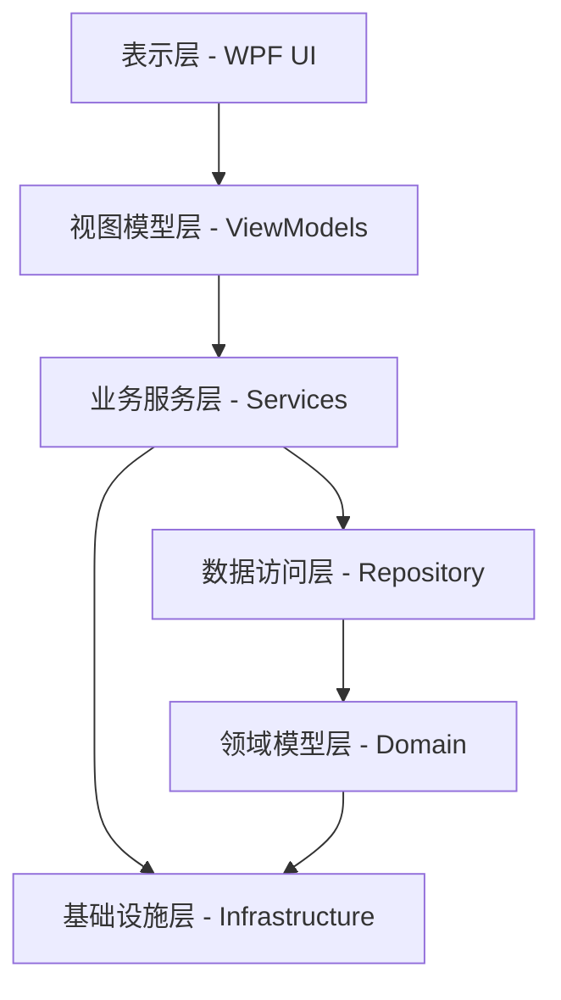
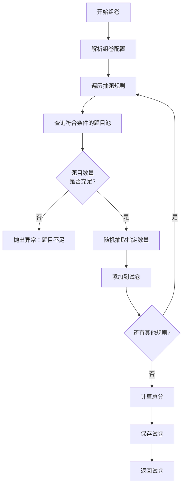
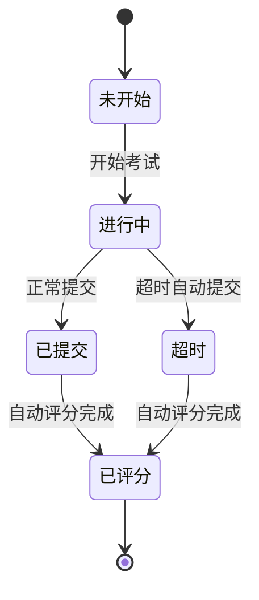
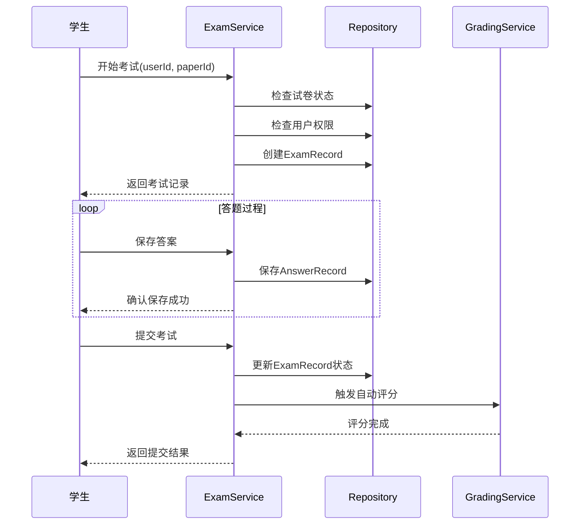
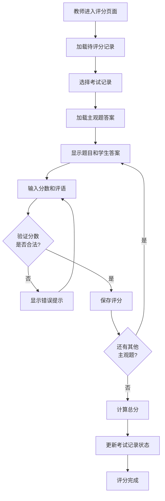
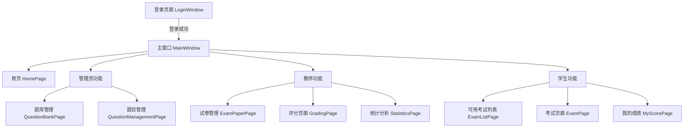

# 在线考试系统 - 继续开发设计文档

## 概述

本文档基于已完成的基础框架，继续完成剩余待实现模块的设计。项目已完成领域模型层、基础设施层的核心工具类、数据访问层的基础仓储以及部分业务服务层。接下来将重点完成试卷管理、考试管理、评分系统、统计分析等核心业务功能的设计。

### 当前完成状态

已实现：
- 领域模型层（实体、枚举、DTO）
- 基础设施层（密码加密、JSON工具、答案比较工具）
- 数据访问层（通用仓储、用户仓储、题目仓储）
- 业务服务层（用户服务、题目服务）
- 视图模型层（登录ViewModel、主窗口ViewModel）

待实现：
- 试卷管理服务
- 考试管理服务
- 评分服务
- 统计分析服务
- 完整的视图模型层
- WPF UI层
- 应用程序配置与启动

## 架构

### 分层架构

本系统采用严格的分层架构，遵循MVVM设计模式：

### 职责划分

| 层次 | 职责 | 依赖关系 |
|------|------|---------|
| UI层 | XAML页面、用户控件、样式资源 | 依赖ViewModels层 |
| ViewModels层 | 视图逻辑、命令绑定、属性通知 | 依赖Services层 |
| Services层 | 业务逻辑编排、事务管理、业务验证 | 依赖Repository层和Infrastructure层 |
| Repository层 | 数据持久化、查询优化 | 依赖Domain层 |
| Domain层 | 实体定义、业务规则、DTO定义 | 独立层，可依赖Infrastructure |
| Infrastructure层 | 通用工具、系统配置、第三方集成 | 独立层 |

## 数据访问层扩展设计

### 新增仓储接口

需要为剩余实体定义专用仓储接口：

#### IExamPaperRepository - 试卷仓储接口

| 方法 | 说明 | 参数 | 返回值 |
|------|------|------|--------|
| GetWithQuestionsAsync | 获取试卷及其关联题目 | paperId (int) | ExamPaper |
| GetByCreatorAsync | 根据创建者获取试卷列表 | creatorId (int) | IEnumerable&lt;ExamPaper&gt; |
| GetByStatusAsync | 根据状态获取试卷列表 | status (PaperStatus) | IEnumerable&lt;ExamPaper&gt; |
| GetActivePapersAsync | 获取当前激活的试卷列表 | - | IEnumerable&lt;ExamPaper&gt; |
| SearchPapersAsync | 搜索试卷（支持关键词、状态、创建者筛选） | keyword (string), status (PaperStatus?), creatorId (int?), pageIndex (int), pageSize (int) | PagedResult&lt;ExamPaper&gt; |

#### IExamRecordRepository - 考试记录仓储接口

| 方法 | 说明 | 参数 | 返回值 |
|------|------|------|--------|
| GetWithDetailsAsync | 获取考试记录及其详细信息 | recordId (int) | ExamRecord |
| GetByUserIdAsync | 根据用户获取考试记录列表 | userId (int) | IEnumerable&lt;ExamRecord&gt; |
| GetByPaperIdAsync | 根据试卷获取考试记录列表 | paperId (int) | IEnumerable&lt;ExamRecord&gt; |
| GetUserExamRecordAsync | 获取用户特定试卷的考试记录 | userId (int), paperId (int) | ExamRecord |
| GetUnfinishedRecordsAsync | 获取未完成的考试记录 | userId (int) | IEnumerable&lt;ExamRecord&gt; |
| GetRecordsNeedGradingAsync | 获取待评分的考试记录 | - | IEnumerable&lt;ExamRecord&gt; |

#### IAnswerRecordRepository - 答题记录仓储接口

| 方法 | 说明 | 参数 | 返回值 |
|------|------|------|--------|
| GetByExamRecordAsync | 获取考试记录的所有答题记录 | examRecordId (int) | IEnumerable&lt;AnswerRecord&gt; |
| GetAnswerRecordAsync | 获取特定题目的答题记录 | examRecordId (int), questionId (int) | AnswerRecord |
| BatchSaveAnswersAsync | 批量保存答题记录 | answerRecords (IEnumerable&lt;AnswerRecord&gt;) | int |
| GetSubjectiveAnswersAsync | 获取主观题答题记录 | examRecordId (int) | IEnumerable&lt;AnswerRecord&gt; |

#### IQuestionBankRepository - 题库仓储接口

| 方法 | 说明 | 参数 | 返回值 |
|------|------|------|--------|
| GetByCreatorAsync | 根据创建者获取题库列表 | creatorId (int) | IEnumerable&lt;QuestionBank&gt; |
| GetPublicBanksAsync | 获取公开题库列表 | - | IEnumerable&lt;QuestionBank&gt; |
| GetBankWithQuestionsAsync | 获取题库及其题目 | bankId (int) | QuestionBank |
| GetBankStatisticsAsync | 获取题库统计信息 | bankId (int) | BankStatistics |

### 仓储实现策略

所有仓储实现需遵循以下原则：

1. **查询优化**：使用EF Core的Include方法预加载关联实体，避免N+1查询问题
2. **异步模式**：所有数据库操作使用异步方法，提高系统响应性
3. **异常处理**：在仓储层捕获数据库异常，转换为业务友好的异常信息
4. **事务支持**：不在仓储层开启事务，由Service层统一管理事务边界

## 业务服务层设计

### IExamPaperService - 试卷服务

试卷服务负责试卷的创建、组卷策略、试卷管理等核心功能。

#### 核心功能

| 功能 | 方法签名 | 说明 |
|------|---------|------|
| 创建固定试卷 | CreateFixedPaperAsync(ExamPaper paper, List&lt;PaperQuestion&gt; questions) | 创建手动选题的试卷 |
| 创建随机试卷 | CreateRandomPaperAsync(ExamPaper paper, RandomPaperConfig config) | 根据配置自动抽题组卷 |
| 创建混合试卷 | CreateMixedPaperAsync(ExamPaper paper, MixedPaperConfig config) | 固定题目+随机抽题 |
| 获取试卷详情 | GetPaperWithQuestionsAsync(paperId) | 获取试卷及其题目列表 |
| 更新试卷 | UpdatePaperAsync(ExamPaper paper) | 更新试卷基本信息 |
| 删除试卷 | DeletePaperAsync(paperId) | 删除试卷（检查是否有考试记录） |
| 激活试卷 | ActivatePaperAsync(paperId) | 将试卷状态改为已激活 |
| 归档试卷 | ArchivePaperAsync(paperId) | 归档试卷 |
| 复制试卷 | DuplicatePaperAsync(paperId) | 复制试卷及其题目配置 |
| 预览试卷 | PreviewPaperAsync(paperId) | 预览试卷内容 |
| 验证试卷 | ValidatePaper(ExamPaper paper) | 验证试卷配置有效性 |

#### 随机组卷配置模型

RandomPaperConfig配置对象结构：

| 字段 | 类型 | 说明 |
|------|------|------|
| BankId | int | 题库ID |
| Rules | List&lt;QuestionSelectionRule&gt; | 抽题规则列表 |

QuestionSelectionRule规则对象结构：

| 字段 | 类型 | 说明 |
|------|------|------|
| QuestionType | QuestionType | 题型 |
| Difficulty | Difficulty? | 难度（可选） |
| Count | int | 抽取数量 |
| ScorePerQuestion | decimal | 每题分值 |

#### 随机组卷算法策略

随机组卷采用分层抽样策略：

抽题算法要点：
1. 根据题型和难度从题库中筛选候选题目
2. 使用Fisher-Yates洗牌算法确保随机性
3. 避免重复抽取同一题目
4. 按规则顺序设置题目序号
5. 自动计算试卷总分

### IExamService - 考试服务

考试服务负责考试流程管理、答题保存、自动提交等功能。

#### 核心功能

| 功能 | 方法签名 | 说明 |
|------|---------|------|
| 开始考试 | StartExamAsync(userId, paperId) | 创建考试记录，初始化答题环境 |
| 恢复考试 | ResumeExamAsync(recordId) | 继续未完成的考试 |
| 保存答案 | SaveAnswerAsync(recordId, questionId, answer) | 保存单题答案 |
| 批量保存答案 | BatchSaveAnswersAsync(recordId, answers) | 批量保存多题答案 |
| 提交考试 | SubmitExamAsync(recordId) | 提交考试并触发自动评分 |
| 获取考试进度 | GetExamProgressAsync(recordId) | 获取答题进度统计 |
| 检查考试时间 | CheckExamTimeAsync(recordId) | 检查是否超时 |
| 自动提交超时考试 | AutoSubmitTimeoutExamsAsync() | 定时任务：自动提交超时考试 |
| 记录异常行为 | RecordAbnormalBehaviorAsync(recordId, behavior) | 记录切屏等异常行为 |

#### 考试状态流转

#### 考试流程

#### 答题记录自动保存策略

- 实时保存：每次答案变更立即保存到数据库
- 防丢失机制：客户端本地缓存答案，网络恢复后同步
- 版本控制：使用时间戳标记答案版本，避免覆盖新答案
- 异常恢复：支持从最后保存点恢复考试

### IGradingService - 评分服务

评分服务负责客观题自动评分和主观题人工评分。

#### 核心功能

| 功能 | 方法签名 | 说明 |
|------|---------|------|
| 自动评分客观题 | AutoGradeObjectiveQuestionsAsync(recordId) | 评分单选、多选、判断、填空题 |
| 人工评分主观题 | ManualGradeSubjectiveQuestionAsync(answerRecordId, score, comment) | 教师评分主观题 |
| 批量评分 | BatchGradeSubjectiveQuestionsAsync(gradeItems) | 批量评分多个主观题 |
| 重新评分 | RegradePaperAsync(recordId) | 重新评分整份试卷 |
| 获取待评分列表 | GetPendingGradingRecordsAsync(teacherId) | 获取待评分的考试记录 |
| 计算总分 | CalculateTotalScoreAsync(recordId) | 计算总分并判断及格 |

#### 客观题自动评分策略

各题型评分规则：

| 题型 | 评分规则 | 实现说明 |
|------|---------|---------|
| 单选题 | 完全正确得分，错误不得分 | 精确匹配学生答案与标准答案 |
| 多选题 | 完全正确得满分，选对但不全得部分分，有错误不得分 | 比较答案集合，部分正确得0.5倍分值 |
| 判断题 | 完全正确得分，错误不得分 | 精确匹配True/False |
| 填空题 | 支持精确匹配和模糊匹配 | 使用AnswerComparer工具类进行模糊匹配 |

#### 填空题模糊匹配算法

使用已实现的AnswerComparer.FuzzyMatch方法：

- 计算Levenshtein距离
- 相似度阈值：85%
- 忽略大小写和前后空格
- 支持多个标准答案（用竖线分隔）

#### 主观题评分流程

### IStatisticsService - 统计分析服务

统计服务提供多维度的数据分析功能。

#### 核心功能

| 功能 | 方法签名 | 说明 |
|------|---------|------|
| 获取试卷统计 | GetPaperStatisticsAsync(paperId) | 试卷总体统计信息 |
| 获取学生成绩统计 | GetStudentScoreStatisticsAsync(userId) | 学生个人成绩统计 |
| 获取题目分析 | GetQuestionAnalysisAsync(questionId) | 题目正确率、得分率分析 |
| 获取班级排名 | GetClassRankingAsync(paperId) | 获取成绩排名 |
| 生成成绩报表 | GenerateScoreReportAsync(paperId) | 生成Excel成绩报表 |
| 获取错题统计 | GetWrongQuestionsAsync(userId) | 获取学生错题集 |

#### 试卷统计维度

PaperStatistics对象结构：

| 字段 | 类型 | 说明 |
|------|------|------|
| PaperId | int | 试卷ID |
| TotalExams | int | 考试总人数 |
| SubmittedCount | int | 已提交人数 |
| GradedCount | int | 已评分人数 |
| PassedCount | int | 及格人数 |
| PassRate | decimal | 及格率 |
| AverageScore | decimal | 平均分 |
| HighestScore | decimal | 最高分 |
| LowestScore | decimal | 最低分 |
| ScoreDistribution | Dictionary&lt;string, int&gt; | 分数段分布（0-60, 60-70...） |

#### 成绩分析算法

分数段分布计算规则：
- 0-60分：不及格
- 60-70分：及格
- 70-80分：中等
- 80-90分：良好
- 90-100分：优秀

题目分析指标：
- 正确率 = 答对人数 / 答题总人数
- 得分率 = 平均得分 / 题目分值
- 区分度 = 高分组正确率 - 低分组正确率（用于评估题目质量）

## 视图模型层设计

所有ViewModel继承自ObservableObject（CommunityToolkit.Mvvm），使用MVVM Toolkit简化属性通知和命令绑定。

### QuestionBankViewModel - 题库管理视图模型

#### 属性

| 属性名 | 类型 | 说明 |
|--------|------|------|
| QuestionBanks | ObservableCollection&lt;QuestionBank&gt; | 题库列表 |
| SelectedBank | QuestionBank | 当前选中的题库 |
| IsLoading | bool | 加载状态 |
| SearchKeyword | string | 搜索关键词 |

#### 命令

| 命令名 | 功能 | 参数 |
|--------|------|------|
| LoadBanksCommand | 加载题库列表 | - |
| CreateBankCommand | 创建新题库 | - |
| EditBankCommand | 编辑题库 | QuestionBank |
| DeleteBankCommand | 删除题库 | int bankId |
| SearchCommand | 搜索题库 | - |

### QuestionManagementViewModel - 题目管理视图模型

#### 属性

| 属性名 | 类型 | 说明 |
|--------|------|------|
| Questions | ObservableCollection&lt;Question&gt; | 题目列表 |
| CurrentPage | int | 当前页码 |
| TotalPages | int | 总页数 |
| PageSize | int | 每页大小 |
| SelectedQuestion | Question | 当前选中题目 |
| FilterType | QuestionType? | 题型筛选 |
| FilterDifficulty | Difficulty? | 难度筛选 |
| FilterKeyword | string | 关键词筛选 |

#### 命令

| 命令名 | 功能 | 参数 |
|--------|------|------|
| LoadQuestionsCommand | 加载题目列表 | - |
| CreateQuestionCommand | 创建新题目 | - |
| EditQuestionCommand | 编辑题目 | Question |
| DeleteQuestionCommand | 删除题目 | int questionId |
| ImportQuestionsCommand | 导入题目 | - |
| ExportQuestionsCommand | 导出题目 | - |
| SearchCommand | 搜索题目 | - |
| NextPageCommand | 下一页 | - |
| PreviousPageCommand | 上一页 | - |

### ExamPaperViewModel - 组卷视图模型

#### 属性

| 属性名 | 类型 | 说明 |
|--------|------|------|
| PaperInfo | ExamPaper | 试卷基本信息 |
| SelectedQuestions | ObservableCollection&lt;PaperQuestion&gt; | 已选题目列表 |
| AvailableQuestions | ObservableCollection&lt;Question&gt; | 可选题目列表 |
| PaperType | PaperType | 组卷类型 |
| RandomConfig | RandomPaperConfig | 随机组卷配置 |
| TotalScore | decimal | 总分 |

#### 命令

| 命令名 | 功能 | 参数 |
|--------|------|------|
| LoadQuestionsCommand | 加载可选题目 | - |
| AddQuestionCommand | 添加题目到试卷 | Question |
| RemoveQuestionCommand | 从试卷移除题目 | PaperQuestion |
| SavePaperCommand | 保存试卷 | - |
| GenerateRandomPaperCommand | 生成随机试卷 | - |
| PreviewPaperCommand | 预览试卷 | - |

### ExamViewModel - 考试视图模型

#### 属性

| 属性名 | 类型 | 说明 |
|--------|------|------|
| ExamRecord | ExamRecord | 考试记录 |
| Paper | ExamPaper | 试卷信息 |
| Questions | ObservableCollection&lt;Question&gt; | 题目列表 |
| Answers | Dictionary&lt;int, string&gt; | 答案字典（题目ID -> 答案） |
| CurrentQuestionIndex | int | 当前题目索引 |
| RemainingTime | TimeSpan | 剩余时间 |
| IsSubmitting | bool | 提交状态 |

#### 命令

| 命令名 | 功能 | 参数 |
|--------|------|------|
| StartExamCommand | 开始考试 | - |
| SaveAnswerCommand | 保存答案 | - |
| NextQuestionCommand | 下一题 | - |
| PreviousQuestionCommand | 上一题 | - |
| SubmitExamCommand | 提交考试 | - |
| JumpToQuestionCommand | 跳转到指定题目 | int index |

#### 考试计时器逻辑

- 使用DispatcherTimer每秒更新剩余时间
- 剩余时间≤5分钟时显示警告
- 剩余时间≤0时自动提交考试
- 计时器在页面加载时启动，卸载时停止

### GradingViewModel - 评分视图模型

#### 属性

| 属性名 | 类型 | 说明 |
|--------|------|------|
| PendingRecords | ObservableCollection&lt;ExamRecord&gt; | 待评分记录 |
| SelectedRecord | ExamRecord | 当前选中记录 |
| SubjectiveAnswers | ObservableCollection&lt;AnswerRecord&gt; | 主观题答案列表 |
| CurrentAnswerIndex | int | 当前评分题目索引 |

#### 命令

| 命令名 | 功能 | 参数 |
|--------|------|------|
| LoadPendingRecordsCommand | 加载待评分记录 | - |
| SelectRecordCommand | 选择考试记录 | ExamRecord |
| SaveGradeCommand | 保存评分 | - |
| NextAnswerCommand | 下一题 | - |
| PreviousAnswerCommand | 上一题 | - |
| FinishGradingCommand | 完成评分 | - |

### StatisticsViewModel - 统计分析视图模型

#### 属性

| 属性名 | 类型 | 说明 |
|--------|------|------|
| Papers | ObservableCollection&lt;ExamPaper&gt; | 试卷列表 |
| SelectedPaper | ExamPaper | 当前选中试卷 |
| Statistics | PaperStatistics | 统计数据 |
| ScoreDistribution | ObservableCollection&lt;ScoreRange&gt; | 分数分布数据（用于图表） |
| Rankings | ObservableCollection&lt;StudentRanking&gt; | 排名列表 |

#### 命令

| 命令名 | 功能 | 参数 |
|--------|------|------|
| LoadPapersCommand | 加载试卷列表 | - |
| LoadStatisticsCommand | 加载统计数据 | int paperId |
| ExportReportCommand | 导出报表 | - |
| RefreshCommand | 刷新数据 | - |

## UI层设计

### 页面结构

### 主窗口布局

MainWindow采用左侧导航+右侧内容的经典布局：

| 区域 | 内容 | 说明 |
|------|------|------|
| 顶部标题栏 | 系统标题、用户信息、退出按钮 | 固定高度60px |
| 左侧导航栏 | 菜单项列表 | 宽度200px，可折叠 |
| 右侧内容区 | 动态内容（Frame或ContentControl） | 自适应剩余空间 |

### 导航菜单设计

菜单项根据用户角色动态显示：

| 菜单项 | 图标 | 可见角色 | 导航目标 |
|--------|------|---------|---------|
| 首页 | Home | 全部 | HomePage |
| 题库管理 | Database | 管理员、教师 | QuestionBankPage |
| 题目管理 | ListCheck | 管理员、教师 | QuestionManagementPage |
| 试卷管理 | FileText | 教师 | ExamPaperPage |
| 评分中心 | ClipboardCheck | 教师 | GradingPage |
| 统计分析 | ChartBar | 教师 | StatisticsPage |
| 可用考试 | BookOpen | 学生 | ExamListPage |
| 我的成绩 | Trophy | 学生 | MyScorePage |
| 用户管理 | Users | 管理员 | UserManagementPage |
| 系统设置 | Settings | 管理员 | SettingsPage |

### 题目管理页面布局

| 区域 | 组件类型 | 功能 |
|------|---------|------|
| 顶部工具栏 | StackPanel | 新建、导入、导出、删除按钮 |
| 筛选栏 | Grid | 题型下拉框、难度下拉框、关键词输入框、搜索按钮 |
| 题目列表 | DataGrid | 显示题目列表，支持多选 |
| 分页控件 | StackPanel | 上一页、页码、下一页、跳转 |

### 组卷页面设计

采用左右分栏布局：

| 区域 | 内容 | 说明 |
|------|------|------|
| 左侧面板 | 试卷基本信息表单 | 名称、描述、时长、及格分、组卷方式 |
| 中间面板 | 可选题目列表 | 从题库选择题目 |
| 右侧面板 | 已选题目列表 | 拖拽排序、设置分值 |
| 底部操作栏 | 保存、预览、取消按钮 | - |

### 考试页面设计

全屏沉浸式布局：

| 区域 | 内容 | 说明 |
|------|------|------|
| 顶部信息栏 | 试卷名称、剩余时间、当前题号 | 固定显示 |
| 中间题目区 | 题目内容、选项/输入框 | 滚动区域 |
| 底部操作栏 | 上一题、下一题、标记、提交按钮 | 固定显示 |
| 右侧答题卡 | 题目缩略图、答题状态 | 可折叠 |

### 样式与主题

#### 颜色方案

| 色彩用途 | 颜色值 | 说明 |
|---------|--------|------|
| 主色调 | #0078D4 | 按钮、链接、高亮 |
| 成功色 | #107C10 | 成功提示、正确答案 |
| 警告色 | #FFB900 | 警告提示、时间不足 |
| 错误色 | #E81123 | 错误提示、错误答案 |
| 背景色 | #F3F2F1 | 页面背景 |
| 卡片背景 | #FFFFFF | 卡片、对话框背景 |
| 文本主色 | #323130 | 正文文字 |
| 文本次色 | #605E5C | 辅助文字 |

#### 字体规范

| 用途 | 字号 | 字重 |
|------|------|------|
| 标题1 | 24px | SemiBold |
| 标题2 | 20px | SemiBold |
| 标题3 | 16px | SemiBold |
| 正文 | 14px | Regular |
| 辅助文字 | 12px | Regular |
| 按钮文字 | 14px | Medium |

### 可复用控件

需要封装的自定义控件：

| 控件名称 | 功能 | 使用场景 |
|---------|------|---------|
| QuestionCard | 题目卡片显示 | 题目列表、试卷预览 |
| AnswerInputControl | 答题输入控件 | 考试页面，根据题型切换输入方式 |
| ScoreRangeChart | 分数分布柱状图 | 统计页面 |
| CountdownTimer | 倒计时组件 | 考试页面 |
| PaginationControl | 分页控件 | 列表页面 |
| ConfirmDialog | 确认对话框 | 删除、提交等操作 |
| LoadingOverlay | 加载遮罩 | 异步操作等待 |

## 应用程序配置

### 依赖注入配置

在App.xaml.cs中配置依赖注入容器（使用Microsoft.Extensions.DependencyInjection）：

#### 服务注册策略

| 服务类型 | 生命周期 | 说明 |
|---------|---------|------|
| DbContext | Scoped | 每次操作创建新实例 |
| Repository | Scoped | 与DbContext同生命周期 |
| Service | Scoped | 业务服务 |
| ViewModel | Transient | 每次导航创建新实例 |
| Window | Transient | 窗口实例 |

#### 配置示例结构

服务注册流程：
1. 注册DbContext，配置SQLite连接字符串
2. 注册所有Repository接口及实现
3. 注册所有Service接口及实现
4. 注册所有ViewModel
5. 注册NavigationService（用于页面导航）
6. 构建ServiceProvider并设置为全局可访问

### 数据库迁移策略

#### 首次运行自动迁移

应用启动时检查数据库是否存在：
- 不存在：自动执行迁移创建数据库
- 存在：检查待应用的迁移，自动更新数据库架构

#### 种子数据

默认创建以下数据：
- 管理员账户：admin / admin123
- 示例题库：通用题库
- 示例题目：各题型示例题目各5道

### 配置文件

使用appsettings.json存储配置：

| 配置项 | 说明 | 示例值 |
|--------|------|--------|
| ConnectionStrings:DefaultConnection | 数据库连接字符串 | "Data Source=exam_system.db" |
| AppSettings:DefaultPassword | 默认密码 | "123456" |
| AppSettings:PageSize | 默认分页大小 | 20 |
| AppSettings:ExamAutoSaveInterval | 考试自动保存间隔（秒） | 30 |
| AppSettings:TimeoutCheckInterval | 超时检查间隔（分钟） | 5 |

### 日志配置

使用Serilog记录日志：

| 日志级别 | 输出目标 | 滚动策略 |
|---------|---------|---------|
| Debug | 控制台 | - |
| Information | 文件(logs/app.log) | 每天一个文件 |
| Warning | 文件(logs/app.log) | 每天一个文件 |
| Error | 文件(logs/error.log) | 每天一个文件 |

## 测试设计

### 单元测试范围

优先测试业务逻辑核心功能：

| 测试目标 | 测试类 | 重点测试方法 |
|---------|--------|-------------|
| PasswordHelper | PasswordHelperTests | 密码加密、验证、强度检查 |
| AnswerComparer | AnswerComparerTests | 精确匹配、模糊匹配、多选题比较 |
| UserService | UserServiceTests | 登录、创建用户、修改密码 |
| QuestionService | QuestionServiceTests | 创建题目、验证题目、导入题目 |
| ExamPaperService | ExamPaperServiceTests | 随机组卷算法、试卷验证 |
| GradingService | GradingServiceTests | 自动评分逻辑、总分计算 |

### 测试数据策略

- 使用In-Memory数据库进行Repository和Service测试
- 使用Builder模式创建测试实体
- 每个测试用例独立数据，避免相互影响

### 集成测试

重点测试完整业务流程：

| 测试场景 | 涉及组件 |
|---------|---------|
| 用户登录流程 | UserService + UserRepository + DbContext |
| 创建试卷流程 | ExamPaperService + QuestionRepository + PaperRepository |
| 完整考试流程 | ExamService + GradingService + 多个Repository |
| 评分与统计流程 | GradingService + StatisticsService |

## 部署方案

### 应用打包

使用ClickOnce或自签名证书打包WPF应用程序：

| 打包方式 | 优点 | 适用场景 |
|---------|------|---------|
| ClickOnce | 自动更新、简单部署 | 校园网内分发 |
| 独立可执行文件 | 无需安装框架 | 单机部署 |
| MSI安装包 | 专业、可定制 | 正式发布 |

### 数据库部署

SQLite数据库文件存放位置：
- 开发环境：项目根目录
- 生产环境：用户AppData目录，避免权限问题

### 更新策略

- 应用程序：ClickOnce自动检测更新
- 数据库架构：通过EF Migration自动升级
- 配置文件：向后兼容，新增配置项提供默认值
