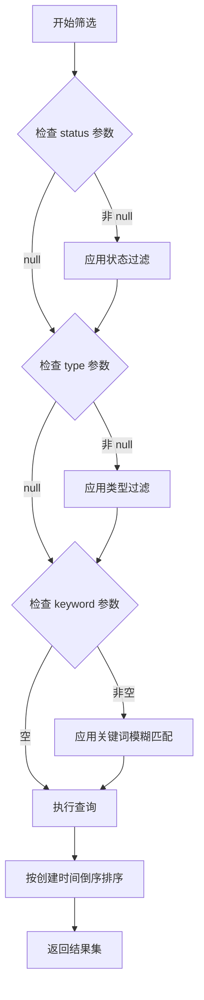
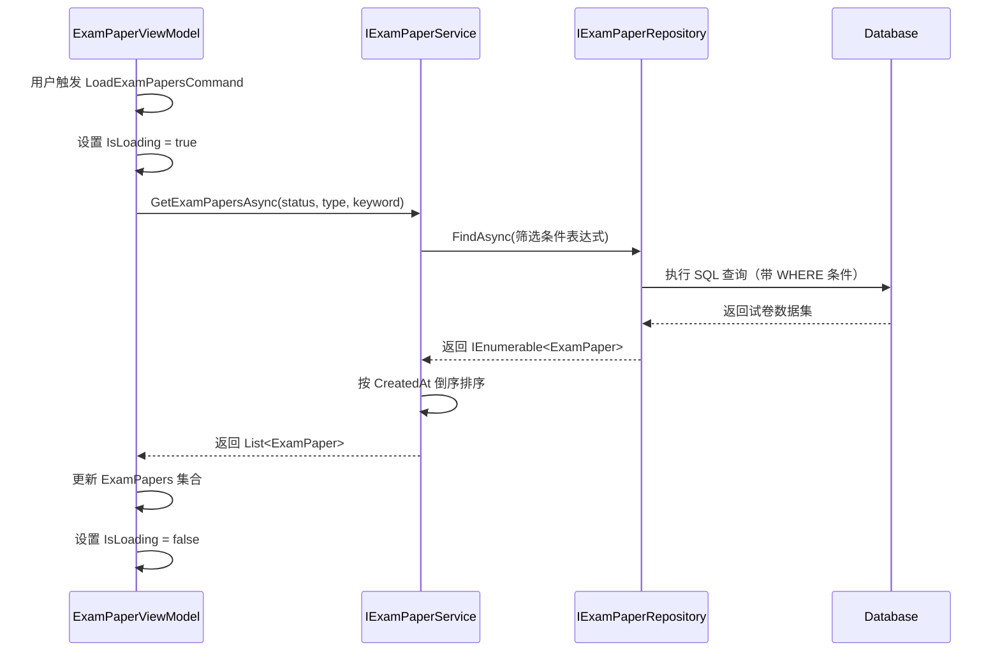
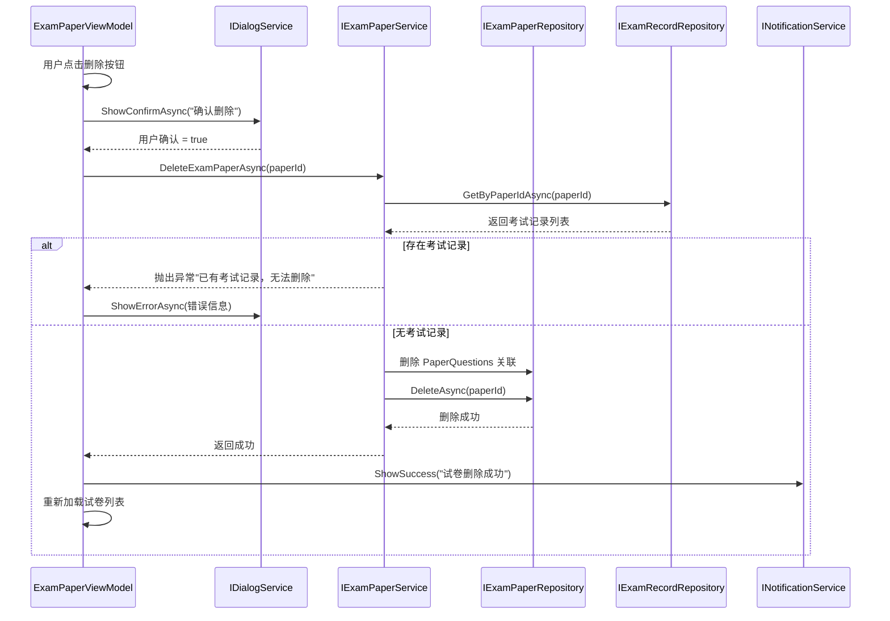

# IExamPaperService 接口方法缺失问题修复设计

## 1. 概述

### 1.1 问题背景
在 ExamPaperViewModel 中调用了 IExamPaperService 接口的两个方法，但这些方法在接口定义中不存在或命名不一致，导致编译错误或运行时异常。

### 1.2 问题范围
- 缺失方法：`GetAllExamPapersAsync()`
- 命名不一致：ViewModel 调用 `DeleteExamPaperAsync(int id)`，但接口定义为 `DeletePaperAsync(int paperId)`

### 1.3 影响组件
| 组件 | 路径 | 影响类型 |
|------|------|---------|
| IExamPaperService | ExamSystem.Services/Interfaces | 需新增接口方法 |
| ExamPaperService | ExamSystem.Services/Implementations | 需实现新方法 |
| ExamPaperViewModel | ExamSystem.ViewModels | 调用方 |

## 2. 问题分析

### 2.1 当前接口定义分析

IExamPaperService 接口当前提供的方法：

| 方法名称 | 功能说明 | 返回类型 | 参数 |
|---------|---------|---------|------|
| CreateFixedPaperAsync | 创建固定试卷 | Task\<ExamPaper\> | ExamPaper, List\<PaperQuestion\> |
| CreateRandomPaperAsync | 创建随机试卷 | Task\<ExamPaper\> | ExamPaper, RandomPaperConfig |
| CreateMixedPaperAsync | 创建混合试卷 | Task\<ExamPaper\> | ExamPaper, MixedPaperConfig |
| GetPaperWithQuestionsAsync | 获取试卷详情 | Task\<ExamPaper\> | int paperId |
| GetPaperQuestionsAsync | 获取试卷题目列表 | Task\<List\<PaperQuestion\>\> | int paperId |
| UpdatePaperAsync | 更新试卷 | Task | ExamPaper |
| **DeletePaperAsync** | 删除试卷 | Task | int paperId |
| ActivatePaperAsync | 激活试卷 | Task | int paperId |
| ArchivePaperAsync | 归档试卷 | Task | int paperId |
| DuplicatePaperAsync | 复制试卷 | Task\<ExamPaper\> | int paperId |
| PreviewPaperAsync | 预览试卷 | Task\<ExamPaper\> | int paperId |
| ValidatePaper | 验证试卷 | ValidationResult | ExamPaper |
| SearchPapersAsync | 搜索试卷 | Task\<PagedResult\<ExamPaper\>\> | string, int?, int, int |

### 2.2 ViewModel 中的调用分析

ExamPaperViewModel 在以下场景调用服务方法：

**场景一：加载试卷列表**
```
调用位置：LoadExamPapersAsync() 方法
调用语句：await _examPaperService.GetAllExamPapersAsync()
期望行为：获取所有试卷列表，支持按状态、类型、关键词筛选
问题：接口中不存在此方法
```

**场景二：删除试卷**
```
调用位置：DeletePaperAsync() 方法
调用语句：await _examPaperService.DeleteExamPaperAsync(SelectedPaper.Id)
期望行为：根据试卷 ID 删除指定试卷
问题：接口方法名称为 DeletePaperAsync，而非 DeleteExamPaperAsync
```

### 2.3 筛选需求分析

ViewModel 中定义了三个筛选属性：

| 属性名称 | 类型 | 用途 | 行为 |
|---------|------|------|------|
| StatusFilter | PaperStatus? | 按试卷状态筛选 | 草稿/已激活/已归档 |
| TypeFilter | PaperType? | 按试卷类型筛选 | 固定/随机/混合 |
| SearchKeyword | string | 按关键词搜索 | 模糊匹配试卷名称或描述 |

当任一筛选条件变更时，自动触发 `LoadExamPapersAsync()` 重新加载数据。

## 3. 设计方案

### 3.1 方案选择

#### 方案对比

| 方案 | 优点 | 缺点 | 推荐度 |
|------|------|------|--------|
| 方案 A：新增 GetAllExamPapersAsync | 符合 ViewModel 调用习惯 | 需要在实现层处理筛选逻辑 | ⭐⭐⭐ |
| 方案 B：使用 SearchPapersAsync | 接口已存在，功能完整 | ViewModel 需修改调用逻辑 | ⭐⭐⭐⭐⭐ |
| 方案 C：重载方法 | 提供多种调用方式 | 增加接口复杂度 | ⭐⭐ |

#### 推荐方案：方案 B + 接口补充

采用混合策略：
1. 新增 `GetAllExamPapersAsync()` 方法用于无条件获取全部试卷
2. 利用现有 `SearchPapersAsync()` 支持高级筛选
3. 统一删除方法命名规范

### 3.2 接口扩展设计

#### 3.2.1 新增方法定义

**GetAllExamPapersAsync 方法**

| 维度 | 说明 |
|------|------|
| 方法签名 | Task\<List\<ExamPaper\>\> GetAllExamPapersAsync() |
| 功能描述 | 获取系统中所有试卷列表，不包含题目详情 |
| 返回值 | 试卷实体集合，按创建时间倒序排列 |
| 异常处理 | 数据库访问异常时抛出 Exception |
| 性能要求 | 支持延迟加载，不预加载关联的题目数据 |

**GetExamPapersAsync 方法（带筛选）**

| 维度 | 说明 |
|------|------|
| 方法签名 | Task\<List\<ExamPaper\>\> GetExamPapersAsync(PaperStatus? status, PaperType? type, string? keyword) |
| 功能描述 | 根据条件筛选试卷列表 |
| 参数说明 | status: 试卷状态过滤器（可选）<br>type: 试卷类型过滤器（可选）<br>keyword: 关键词搜索（可选，模糊匹配名称和描述） |
| 筛选逻辑 | 多条件组合使用 AND 逻辑<br>null 值参数表示不应用该筛选条件 |
| 返回值 | 符合条件的试卷集合 |

#### 3.2.2 方法命名统一

**删除方法命名规范化**

| 当前命名 | 统一后命名 | 调整理由 |
|---------|-----------|---------|
| DeletePaperAsync | DeleteExamPaperAsync | 与领域实体 ExamPaper 保持一致 |
| - | - | 提升接口方法的语义清晰度 |

### 3.3 服务实现逻辑

#### 3.3.1 GetAllExamPapersAsync 实现逻辑

```
执行流程：
1. 调用仓储层 _paperRepository 的查询方法
2. 获取所有试卷实体（不包含导航属性）
3. 按 CreatedAt 字段倒序排序
4. 返回试卷集合
```

#### 3.3.2 GetExamPapersAsync 实现逻辑



**筛选规则表**

| 筛选条件 | 应用方式 | 示例 |
|---------|---------|------|
| 状态筛选 | Status == status | Status == PaperStatus.Activated |
| 类型筛选 | PaperType == type | PaperType == PaperType.Random |
| 关键词搜索 | Name.Contains(keyword) OR Description.Contains(keyword) | 搜索"期末"匹配所有名称或描述包含"期末"的试卷 |

### 3.4 仓储层支持

#### 3.4.1 需要的仓储方法

IExamPaperRepository 需提供的查询能力：

| 方法名称 | 功能 | 参数 | 返回类型 |
|---------|------|------|---------|
| GetAllAsync | 获取全部试卷 | 无 | Task\<IEnumerable\<ExamPaper\>\> |
| FindAsync | 条件查询 | Expression\<Func\<ExamPaper, bool\>\> | Task\<IEnumerable\<ExamPaper\>\> |

#### 3.4.2 查询性能优化策略

| 优化项 | 策略 | 预期效果 |
|-------|------|---------|
| 延迟加载 | 不加载 PaperQuestions 导航属性 | 减少 50% 数据传输量 |
| 索引利用 | 在 Status、PaperType、CreatedAt 字段上建立索引 | 提升筛选查询速度 |
| 分页支持 | 未来扩展为分页查询 | 支持大数据量场景 |

## 4. ViewModel 调整策略

### 4.1 调用方法替换方案

#### 方案 A：使用 GetAllExamPapersAsync（简单场景）

**适用场景**：试卷数量较少（< 100 条），在客户端进行筛选

调用逻辑：
```
步骤 1：调用 GetAllExamPapersAsync() 获取全部试卷
步骤 2：在内存中应用 StatusFilter、TypeFilter、SearchKeyword 筛选
步骤 3：更新 ExamPapers ObservableCollection
```

**优点**：减少服务端请求次数，筛选响应快
**缺点**：不适合大数据量，初次加载耗时

#### 方案 B：使用 GetExamPapersAsync（推荐）

**适用场景**：试卷数量较多，需要服务端筛选

调用逻辑：
```
步骤 1：收集当前筛选条件（StatusFilter、TypeFilter、SearchKeyword）
步骤 2：调用 GetExamPapersAsync(status, type, keyword)
步骤 3：直接使用返回结果更新 ExamPapers
```

**优点**：服务端筛选，性能优，支持扩展为分页
**缺点**：每次筛选条件变更需请求服务端

### 4.2 筛选属性变更处理

当前 ViewModel 中筛选属性变更时自动触发加载：

```
属性变更链路：
StatusFilter 值变更 → SetProperty 返回 true → 调用 LoadExamPapersAsync()
TypeFilter 值变更 → SetProperty 返回 true → 调用 LoadExamPapersAsync()
SearchKeyword 值变更 → SetProperty 返回 true → 调用 LoadExamPapersAsync()
```

**优化建议**：

| 优化项 | 实现方式 | 目的 |
|-------|---------|------|
| 防抖动 | SearchKeyword 变更后延迟 300ms 再触发查询 | 避免频繁输入导致的多次请求 |
| 取消令牌 | 使用 CancellationTokenSource | 取消未完成的旧请求 |
| 加载状态 | IsLoading 属性控制 UI 状态 | 提供用户反馈 |

### 4.3 删除方法调用修正

**当前调用**：
```
方法名：DeleteExamPaperAsync(int id)
问题：接口中不存在该名称的方法
```

**修正后调用**：
```
调用接口方法：DeleteExamPaperAsync(int paperId)
调用位置：ExamPaperViewModel.DeletePaperAsync() 方法
参数传递：SelectedPaper.Id
```

## 5. 数据流设计

### 5.1 试卷列表加载流程



### 5.2 试卷删除流程



## 6. 接口契约定义

### 6.1 完整接口方法清单

| 方法签名 | 分类 | 新增/修改 |
|---------|------|-----------|
| Task\<ExamPaper\> CreateFixedPaperAsync(ExamPaper, List\<PaperQuestion\>) | 创建 | 保持 |
| Task\<ExamPaper\> CreateRandomPaperAsync(ExamPaper, RandomPaperConfig) | 创建 | 保持 |
| Task\<ExamPaper\> CreateMixedPaperAsync(ExamPaper, MixedPaperConfig) | 创建 | 保持 |
| **Task\<List\<ExamPaper\>\> GetAllExamPapersAsync()** | 查询 | **新增** |
| **Task\<List\<ExamPaper\>\> GetExamPapersAsync(PaperStatus?, PaperType?, string?)** | 查询 | **新增** |
| Task\<ExamPaper\> GetPaperWithQuestionsAsync(int) | 查询 | 保持 |
| Task\<List\<PaperQuestion\>\> GetPaperQuestionsAsync(int) | 查询 | 保持 |
| Task UpdatePaperAsync(ExamPaper) | 更新 | 保持 |
| **Task DeleteExamPaperAsync(int)** | 删除 | **重命名** |
| Task ActivatePaperAsync(int) | 状态管理 | 保持 |
| Task ArchivePaperAsync(int) | 状态管理 | 保持 |
| Task\<ExamPaper\> DuplicatePaperAsync(int) | 操作 | 保持 |
| Task\<ExamPaper\> PreviewPaperAsync(int) | 操作 | 保持 |
| ValidationResult ValidatePaper(ExamPaper) | 验证 | 保持 |
| Task\<PagedResult\<ExamPaper\>\> SearchPapersAsync(string, int?, int, int) | 查询 | 保持 |

### 6.2 新增方法详细规格

#### GetAllExamPapersAsync

| 属性 | 值 |
|------|-----|
| 访问修饰符 | public |
| 返回类型 | Task\<List\<ExamPaper\>\> |
| 参数 | 无 |
| 前置条件 | 无 |
| 后置条件 | 返回非 null 集合（可能为空集合） |
| 异常 | 数据库访问失败时抛出异常 |
| 幂等性 | 是 |
| 并发安全 | 是（只读操作） |

#### GetExamPapersAsync

| 属性 | 值 |
|------|-----|
| 访问修饰符 | public |
| 返回类型 | Task\<List\<ExamPaper\>\> |
| 参数 1 | PaperStatus? status - 可选的试卷状态筛选 |
| 参数 2 | PaperType? type - 可选的试卷类型筛选 |
| 参数 3 | string? keyword - 可选的关键词搜索 |
| 前置条件 | keyword 长度不超过 100 字符 |
| 后置条件 | 返回符合条件的试卷集合，按创建时间倒序 |
| 异常 | keyword 超长时抛出 ArgumentException |
| 幂等性 | 是 |
| 并发安全 | 是（只读操作） |

## 7. 测试策略

### 7.1 服务层测试用例

#### GetAllExamPapersAsync 测试

| 用例编号 | 测试场景 | 输入 | 期望输出 | 断言点 |
|---------|---------|------|---------|--------|
| TC-001 | 数据库无试卷 | 无 | 空集合 | Count == 0 |
| TC-002 | 数据库有 5 条试卷 | 无 | 5 条试卷 | Count == 5 |
| TC-003 | 验证排序顺序 | 无 | 按 CreatedAt 倒序 | 第一条为最新创建 |
| TC-004 | 不加载关联题目 | 无 | PaperQuestions == null | 验证延迟加载 |

#### GetExamPapersAsync 测试

| 用例编号 | 测试场景 | status | type | keyword | 期望结果 |
|---------|---------|--------|------|---------|---------|
| TC-010 | 全部参数为 null | null | null | null | 返回所有试卷 |
| TC-011 | 仅按状态筛选 | Activated | null | null | 仅返回已激活试卷 |
| TC-012 | 仅按类型筛选 | null | Random | null | 仅返回随机试卷 |
| TC-013 | 仅关键词搜索 | null | null | "期末" | 名称或描述含"期末" |
| TC-014 | 组合筛选 | Draft | Fixed | "数学" | 同时满足三个条件 |
| TC-015 | 无匹配结果 | Activated | Fixed | "不存在" | 空集合 |

#### DeleteExamPaperAsync 测试

| 用例编号 | 测试场景 | 前置条件 | 期望行为 |
|---------|---------|---------|---------|
| TC-020 | 删除无考试记录的试卷 | 试卷无关联考试记录 | 成功删除 |
| TC-021 | 删除有考试记录的试卷 | 试卷有关联考试记录 | 抛出异常拒绝删除 |
| TC-022 | 删除不存在的试卷 | paperId 不存在 | 抛出异常 |
| TC-023 | 验证级联删除 | 试卷有关联题目 | PaperQuestions 同步删除 |

### 7.2 ViewModel 层测试

#### LoadExamPapersAsync 测试

| 用例编号 | 测试场景 | 验证点 |
|---------|---------|--------|
| TC-030 | 初始加载 | IsLoading 状态正确切换 |
| TC-031 | 筛选条件变更 | 自动触发重新加载 |
| TC-032 | 服务异常处理 | 显示错误对话框 |
| TC-033 | 加载成功 | ExamPapers 集合正确更新 |

#### DeletePaperCommand 测试

| 用例编号 | 测试场景 | 验证点 |
|---------|---------|--------|
| TC-040 | SelectedPaper 为 null | Command 不可执行 |
| TC-041 | 用户取消删除 | 不调用服务方法 |
| TC-042 | 删除成功 | 显示成功通知并刷新列表 |
| TC-043 | 删除失败 | 显示错误对话框 |

## 8. 兼容性影响分析

### 8.1 接口变更影响范围

| 变更类型 | 变更内容 | 影响组件 | 兼容性 |
|---------|---------|---------|--------|
| 新增方法 | GetAllExamPapersAsync | 无破坏性变更 | ✅ 向后兼容 |
| 新增方法 | GetExamPapersAsync | 无破坏性变更 | ✅ 向后兼容 |
| 方法重命名 | DeletePaperAsync → DeleteExamPaperAsync | 所有调用方需同步修改 | ⚠️ 破坏性变更 |

### 8.2 重命名影响组件清单

需要同步修改的调用位置：

| 组件 | 文件路径 | 调用位置 | 修改内容 |
|------|---------|---------|---------|
| ExamPaperViewModel | ExamSystem.ViewModels | DeletePaperAsync 方法 | 方法调用名称 |
| 其他 ViewModel | 待检查 | 待检查 | 待确认 |

### 8.3 迁移策略

**方案 A：保留旧方法（推荐）**
- 保留 DeletePaperAsync 作为兼容方法
- 标记为 Obsolete 特性
- 内部调用 DeleteExamPaperAsync
- 给予 6 个月过渡期后移除

**方案 B：直接重命名**
- 一次性重命名为 DeleteExamPaperAsync
- 全局搜索并替换所有调用点
- 更新单元测试

## 9. 实施检查清单

### 9.1 接口层任务

- [ ] 在 IExamPaperService 接口中新增 GetAllExamPapersAsync 方法声明
- [ ] 在 IExamPaperService 接口中新增 GetExamPapersAsync 方法声明
- [ ] 决定 DeletePaperAsync 重命名策略（方案 A 或 B）
- [ ] 更新接口 XML 文档注释

### 9.2 服务实现层任务

- [ ] 在 ExamPaperService 中实现 GetAllExamPapersAsync 方法
- [ ] 在 ExamPaperService 中实现 GetExamPapersAsync 方法
- [ ] 实现筛选逻辑（状态、类型、关键词组合）
- [ ] 处理 DeleteExamPaperAsync 重命名或兼容
- [ ] 添加方法 XML 文档注释

### 9.3 仓储层任务

- [ ] 检查 IExamPaperRepository 是否提供 GetAllAsync 方法
- [ ] 检查 IExamPaperRepository 是否支持条件查询 FindAsync
- [ ] 确认查询不加载 PaperQuestions 导航属性
- [ ] 验证数据库索引配置（Status、PaperType、CreatedAt）

### 9.4 ViewModel 层任务

- [ ] 修改 LoadExamPapersAsync 调用 GetExamPapersAsync
- [ ] 传递筛选参数（StatusFilter、TypeFilter、SearchKeyword）
- [ ] 修正 DeletePaperCommand 中的方法调用名称
- [ ] 实现 SearchKeyword 防抖动优化（可选）
- [ ] 添加 CancellationTokenSource 取消机制（可选）

### 9.5 测试任务

- [ ] 编写 GetAllExamPapersAsync 单元测试
- [ ] 编写 GetExamPapersAsync 单元测试（覆盖所有筛选组合）
- [ ] 更新 DeleteExamPaperAsync 单元测试
- [ ] 编写 ViewModel 集成测试
- [ ] 执行回归测试确保现有功能不受影响

### 9.6 文档任务

- [ ] 更新 API 接口文档
- [ ] 更新架构文档中的服务层说明
- [ ] 记录变更日志（CHANGELOG）
- [ ] 更新开发者指南（如有）
