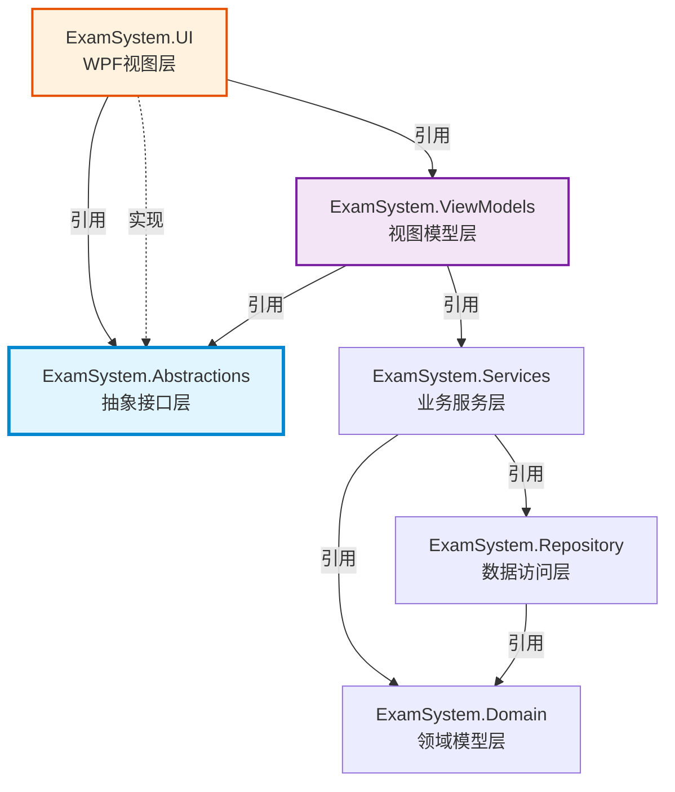
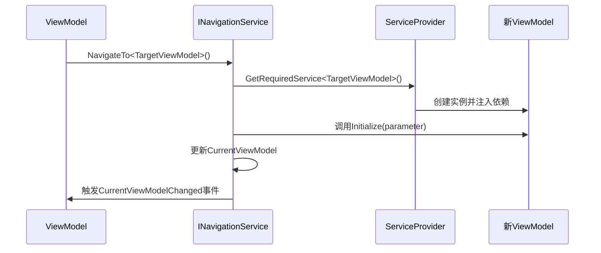
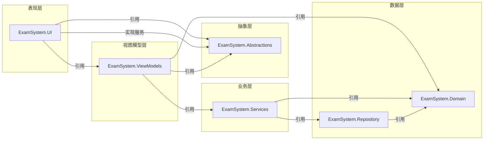
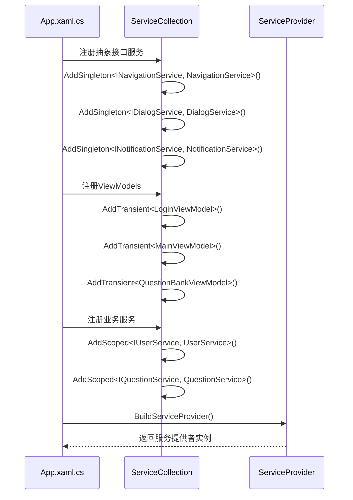
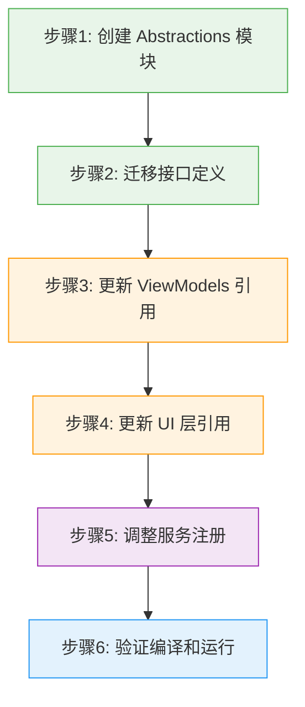
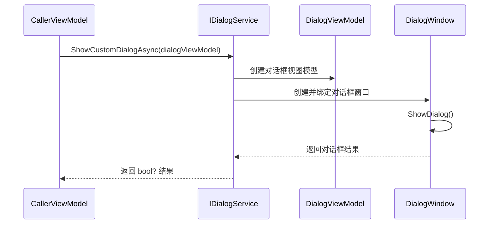
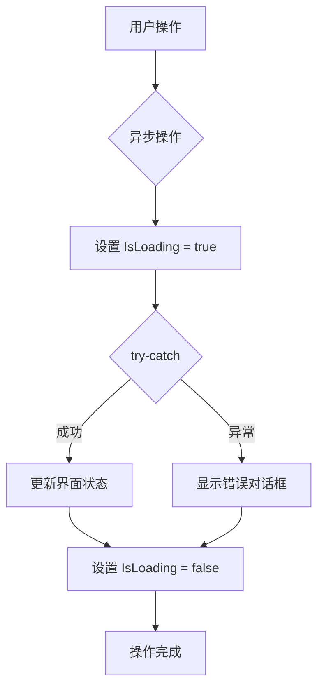

# ViewModel 模块与 UI 模块解耦设计方案

## 概述

### 背景
当前架构中存在循环依赖问题：
- `ExamSystem.ViewModels` 需要引用 UI 层服务接口（IDialogService、INavigationService、INotificationService）
- `ExamSystem.UI` 需要引用 ViewModels 层创建视图模型实例
- 导致 ViewModels 和 UI 模块无法实现清晰分层

### 解决目标
- 消除 ViewModels 与 UI 层的直接依赖
- 保持 MVVM 模式的完整性和职责分离
- 实现 ViewModels 的可测试性和可复用性
- 支持依赖注入和服务抽象

### 设计原则
- **依赖倒置原则**：高层模块不应依赖低层模块，两者都应依赖抽象
- **接口隔离原则**：接口应该放在使用它的模块中
- **单一职责原则**：每个模块只负责特定的功能领域

---

## 架构设计

### 整体分层结构



### 核心解决方案：引入抽象层

创建独立的 `ExamSystem.Abstractions` 模块，作为 ViewModels 和 UI 之间的契约层。

| 模块 | 职责 | 依赖方向 |
|------|------|----------|
| ExamSystem.Abstractions | 定义 UI 服务接口抽象 | 无其他模块依赖 |
| ExamSystem.ViewModels | 业务逻辑和状态管理 | 依赖 Abstractions |
| ExamSystem.UI | 视图实现和服务实现 | 依赖 Abstractions + ViewModels |

---

## 抽象接口设计

### 服务接口分类

| 接口类别 | 接口名称 | 核心职责 |
|---------|---------|---------|
| 导航服务 | INavigationService | 页面导航、视图模型切换 |
| 对话框服务 | IDialogService | 消息提示、确认对话框、输入框 |
| 通知服务 | INotificationService | 成功/失败/警告通知 |
| 文件对话框服务 | IFileDialogService | 文件选择、保存对话框 |

### 导航服务接口

**职责范围**
- 提供类型安全的视图模型导航机制
- 支持带参数的导航传递
- 管理导航历史栈
- 触发视图模型变更事件

**接口契约**

| 方法签名 | 说明 | 返回值 |
|---------|------|--------|
| NavigateTo\<TViewModel\>() | 导航到指定视图模型类型 | void |
| NavigateTo\<TViewModel\>(object parameter) | 带参数导航 | void |
| NavigateTo(Type viewModelType) | 动态类型导航 | void |
| GoBack() | 返回上一页 | void |
| CanGoBack | 是否可以返回 | bool |
| CurrentViewModel | 当前活动视图模型 | object |
| CurrentViewModelChanged | 视图模型变更事件 | EventHandler |

**导航流程**



### 对话框服务接口

**职责范围**
- 提供异步对话框操作
- 支持多种对话框类型（信息、警告、错误、确认）
- 处理用户输入对话框
- 支持自定义对话框视图模型

**接口契约**

| 方法签名 | 说明 | 返回值 |
|---------|------|--------|
| ShowMessageAsync(title, message) | 显示信息对话框 | Task |
| ShowErrorAsync(title, error) | 显示错误对话框 | Task |
| ShowWarningAsync(title, warning) | 显示警告对话框 | Task |
| ShowConfirmAsync(title, message) | 显示确认对话框 | Task\<bool\> |
| ShowInputDialogAsync(title, prompt, defaultValue) | 显示输入对话框 | Task\<string\> |
| ShowCustomDialogAsync\<TViewModel\>(viewModel) | 显示自定义对话框 | Task\<bool?\> |

### 通知服务接口

**职责范围**
- 提供轻量级非阻塞通知
- 支持成功、失败、信息、警告等通知类型
- 自动消失机制

**接口契约**

| 方法签名 | 说明 | 通知类型 |
|---------|------|---------|
| ShowSuccess(message) | 成功通知 | Success |
| ShowError(message) | 错误通知 | Error |
| ShowInfo(message) | 信息通知 | Info |
| ShowWarning(message) | 警告通知 | Warning |
| ShowSuccess(message, duration) | 带持续时间的成功通知 | Success |

### 文件对话框服务接口

**职责范围**
- 提供文件选择对话框
- 支持单文件/多文件选择
- 提供文件保存对话框
- 支持文件过滤器

**接口契约**

| 方法签名 | 说明 | 返回值 |
|---------|------|--------|
| OpenFileDialogAsync(filter, multiSelect) | 打开文件对话框 | Task\<string[]\> |
| SaveFileDialogAsync(defaultFileName, filter) | 保存文件对话框 | Task\<string\> |
| OpenFolderDialogAsync() | 文件夹选择对话框 | Task\<string\> |

---

## 模块依赖关系

### 依赖关系图



### 项目引用关系表

| 项目 | 引用的项目 | 引用原因 |
|------|-----------|---------|
| ExamSystem.Abstractions | 无 | 纯接口定义，无依赖 |
| ExamSystem.ViewModels | Abstractions, Services, Domain | 需要服务接口、业务逻辑、领域模型 |
| ExamSystem.UI | ViewModels, Abstractions, Services, Infrastructure | 需要视图模型绑定、实现服务接口 |
| ExamSystem.Services | Repository, Domain | 业务逻辑处理 |
| ExamSystem.Repository | Domain | 数据访问 |
| ExamSystem.Domain | 无 | 领域模型，无依赖 |

---

## 服务注册与依赖注入

### 服务注册流程



### 服务生命周期策略

| 服务类型 | 生命周期 | 原因 |
|---------|---------|------|
| INavigationService | Singleton | 全局单例，管理应用导航状态 |
| IDialogService | Singleton | 全局单例，无状态服务 |
| INotificationService | Singleton | 全局单例，管理通知队列 |
| IFileDialogService | Singleton | 全局单例，无状态服务 |
| ViewModels | Transient | 每次导航创建新实例 |
| IUserService | Scoped | 请求范围内共享 |
| IQuestionService | Scoped | 请求范围内共享 |

### 依赖注入示例

**ViewModel 构造函数注入**

ViewModels 通过构造函数接收依赖的服务接口：

| ViewModel | 注入的服务接口 |
|-----------|---------------|
| LoginViewModel | IUserService, INavigationService, IDialogService |
| MainViewModel | INavigationService |
| QuestionBankViewModel | IQuestionService, IDialogService, INotificationService, IFileDialogService |
| ExamTakingViewModel | IExamService, IGradingService, IDialogService, INotificationService |

**服务解析流程**

当 NavigationService 导航到某个 ViewModel 时：
1. ServiceProvider 解析 ViewModel 类型
2. 识别构造函数参数依赖
3. 递归解析所有依赖的服务
4. 创建 ViewModel 实例并注入依赖
5. 调用 Initialize 方法传递导航参数

---

## 实现策略

### 接口定义位置

**ExamSystem.Abstractions 模块结构**

```
ExamSystem.Abstractions/
├── Services/
│   ├── INavigationService.cs      # 导航服务接口
│   ├── IDialogService.cs          # 对话框服务接口
│   ├── INotificationService.cs    # 通知服务接口
│   └── IFileDialogService.cs      # 文件对话框服务接口
└── ExamSystem.Abstractions.csproj
```

**模块依赖定义**

Abstractions 模块只依赖：
- CommunityToolkit.Mvvm（用于 ObservableObject 基类引用）
- 无其他项目引用

### 接口实现位置

**ExamSystem.UI 模块结构**

```
ExamSystem.UI/
├── Services/
│   ├── NavigationService.cs       # 导航服务实现
│   ├── DialogService.cs           # 对话框服务实现
│   ├── NotificationService.cs     # 通知服务实现
│   └── FileDialogService.cs       # 文件对话框服务实现
├── Views/                         # XAML 视图文件
└── ExamSystem.UI.csproj
```

服务实现类可以使用 WPF 特定的 API（Window、MessageBox、Dispatcher 等）。

### ViewModel 改造策略

**移除直接的 UI 层引用**

| 改造项 | 改造前 | 改造后 |
|--------|--------|--------|
| 命名空间引用 | using ExamSystem.UI.Services; | using ExamSystem.Abstractions.Services; |
| 项目引用 | 引用 ExamSystem.UI | 引用 ExamSystem.Abstractions |
| 服务注入 | 无变化 | 无变化 |

**改造影响的 ViewModel 列表**

| ViewModel | 使用的服务接口 |
|-----------|---------------|
| LoginViewModel | INavigationService, IDialogService |
| MainViewModel | INavigationService |
| QuestionBankViewModel | IDialogService, INotificationService, IFileDialogService |
| ExamTakingViewModel | IDialogService, INotificationService |
| UserManagementViewModel | IDialogService, INotificationService |
| SystemSettingsViewModel | IDialogService, INotificationService, IFileDialogService |

---

## 迁移方案

### 迁移步骤



### 详细迁移步骤

**步骤 1：创建 ExamSystem.Abstractions 项目**

| 操作 | 说明 |
|------|------|
| 创建项目 | 类库项目，目标框架 net5.0 |
| 添加 NuGet 包 | CommunityToolkit.Mvvm 8.2.2 |
| 创建目录结构 | Services/ |

**步骤 2：迁移接口定义**

从 ExamSystem.UI/Services/ 迁移以下接口到 ExamSystem.Abstractions/Services/：
- INavigationService
- IDialogService
- INotificationService
- IFileDialogService

迁移后保持接口签名不变，只修改命名空间：
- 原命名空间：`ExamSystem.UI.Services`
- 新命名空间：`ExamSystem.Abstractions.Services`

**步骤 3：更新 ExamSystem.ViewModels 项目引用**

| 操作 | 说明 |
|------|------|
| 移除项目引用 | 删除对 ExamSystem.UI 的引用（如果存在） |
| 添加项目引用 | 添加对 ExamSystem.Abstractions 的引用 |
| 更新命名空间 | 将所有 ViewModel 文件中的 `using ExamSystem.UI.Services` 改为 `using ExamSystem.Abstractions.Services` |

**步骤 4：更新 ExamSystem.UI 项目引用**

| 操作 | 说明 |
|------|------|
| 添加项目引用 | 添加对 ExamSystem.Abstractions 的引用 |
| 更新服务实现 | 服务实现类继续保留在 ExamSystem.UI/Services/ |
| 更新命名空间 | 服务实现类实现 ExamSystem.Abstractions.Services 中的接口 |
| 删除旧接口文件 | 从 ExamSystem.UI/Services/ 删除已迁移的接口定义文件 |

**步骤 5：调整依赖注入配置**

在 App.xaml.cs 的 ConfigureServices 方法中：

| 服务 | 注册方式 | 生命周期 |
|------|---------|---------|
| INavigationService | AddSingleton\<INavigationService, NavigationService\>() | Singleton |
| IDialogService | AddSingleton\<IDialogService, DialogService\>() | Singleton |
| INotificationService | AddSingleton\<INotificationService, NotificationService\>() | Singleton |
| IFileDialogService | AddSingleton\<IFileDialogService, FileDialogService\>() | Singleton |

确保接口类型引用 ExamSystem.Abstractions 命名空间，实现类型引用 ExamSystem.UI 命名空间。

**步骤 6：编译验证**

| 验证项 | 预期结果 |
|--------|---------|
| ExamSystem.Abstractions 编译 | 成功，无依赖警告 |
| ExamSystem.ViewModels 编译 | 成功，无循环依赖 |
| ExamSystem.UI 编译 | 成功 |
| 应用启动 | 正常启动，服务注入成功 |
| 导航功能 | 导航正常工作 |
| 对话框功能 | 对话框正常显示 |

---

## 测试策略

### 单元测试改进

**ViewModel 单元测试的优势**

| 优势 | 说明 |
|------|------|
| 完全可测试 | ViewModel 不再依赖 UI 层，可以纯单元测试 |
| 模拟服务 | 可以使用 Mock 框架模拟 INavigationService 等服务 |
| 隔离测试 | 无需启动 WPF 应用，测试运行更快 |

**测试示例结构**

```
ExamSystem.Tests/
├── ViewModels/
│   ├── LoginViewModelTests.cs
│   ├── QuestionBankViewModelTests.cs
│   └── ExamTakingViewModelTests.cs
└── Mocks/
    ├── MockNavigationService.cs
    ├── MockDialogService.cs
    └── MockNotificationService.cs
```

### Mock 服务实现策略

**Mock 服务的职责**

| Mock 服务 | 测试用途 |
|-----------|---------|
| MockNavigationService | 验证导航调用、记录导航参数 |
| MockDialogService | 模拟对话框返回值、验证对话框调用 |
| MockNotificationService | 记录通知消息内容和类型 |
| MockFileDialogService | 模拟文件选择结果 |

**测试验证点**

| 测试场景 | 验证内容 |
|---------|---------|
| 登录成功 | 验证调用了 NavigateTo\<MainViewModel\>() |
| 登录失败 | 验证显示了错误对话框 |
| 删除题目 | 验证显示了确认对话框，并根据返回值决定是否删除 |
| 导入题目 | 验证调用了文件选择对话框 |

---

## 扩展性设计

### 支持多种 UI 框架

通过抽象层，ViewModels 可以复用于不同的 UI 技术栈：

| UI 框架 | 实现方式 |
|---------|---------|
| WPF | 当前实现 |
| WinUI 3 | 创建 ExamSystem.WinUI 项目，实现相同接口 |
| Avalonia | 创建 ExamSystem.Avalonia 项目，实现相同接口 |
| Uno Platform | 创建 ExamSystem.Uno 项目，实现相同接口 |

### 自定义导航行为

**导航拦截器接口**

支持在导航前后添加自定义逻辑：

| 拦截点 | 用途 |
|--------|------|
| OnNavigatingFrom | 离开当前页面前验证（如未保存提示） |
| OnNavigatedTo | 进入新页面后初始化（如加载数据） |
| CanNavigate | 判断是否允许导航（如权限检查） |

**导航参数传递策略**

| 策略 | 适用场景 |
|------|---------|
| 强类型参数 | 使用泛型定义导航参数类型 |
| 字典参数 | 动态参数传递 |
| 查询字符串 | 类似 Web 的参数传递 |

### 对话框视图模型策略

**自定义对话框流程**



**对话框视图模型基类**

对话框视图模型应包含的标准成员：

| 成员 | 类型 | 说明 |
|------|------|------|
| DialogResult | bool? | 对话框结果 |
| CloseCommand | ICommand | 关闭对话框命令 |
| ConfirmCommand | ICommand | 确认命令 |
| CancelCommand | ICommand | 取消命令 |

---

## 最佳实践

### 服务接口设计原则

| 原则 | 说明 |
|------|------|
| 异步优先 | 所有可能阻塞 UI 的操作都应该是异步的（返回 Task） |
| 接口隔离 | 不要创建大而全的接口，按职责拆分小接口 |
| 返回值明确 | 对话框服务应明确返回用户操作结果（如 bool、string） |
| 无 UI 依赖 | 接口定义不应包含 WPF 特定类型（如 Window、MessageBoxResult） |

### ViewModel 编写规范

| 规范 | 说明 |
|------|------|
| 构造函数注入 | 所有依赖通过构造函数注入，避免服务定位器模式 |
| 单一职责 | 每个 ViewModel 只负责一个视图的逻辑 |
| 避免循环引用 | ViewModel 之间不应相互引用，通过导航服务切换 |
| 异步命令 | 使用 IAsyncRelayCommand 处理异步操作 |

### 依赖注入最佳实践

| 实践 | 说明 |
|------|------|
| 优先使用接口 | 依赖抽象而非具体实现 |
| 生命周期选择 | 根据服务特性选择合适的生命周期 |
| 避免服务定位器 | 不要在 ViewModel 中直接调用 ServiceProvider.GetService |
| 延迟解析 | 使用 Func\<T\> 或 Lazy\<T\> 延迟解析大对象 |

### 错误处理策略

**错误处理流程**



**错误显示策略**

| 错误类型 | 显示方式 |
|---------|---------|
| 验证错误 | 通知服务（非阻塞） |
| 业务错误 | 对话框服务（阻塞） |
| 系统错误 | 对话框服务 + 日志记录 |
| 网络错误 | 对话框服务 + 重试选项 |

---

## 收益分析

### 架构收益

| 收益点 | 说明 |
|--------|------|
| 清晰分层 | ViewModels 和 UI 层职责明确，无循环依赖 |
| 可测试性 | ViewModels 可以完全脱离 UI 进行单元测试 |
| 可维护性 | 接口变更只影响实现层，不影响使用层 |
| 可扩展性 | 易于支持多平台 UI、插件化架构 |

### 开发效率

| 改进点 | 说明 |
|--------|------|
| 并行开发 | UI 和 ViewModel 可以基于接口契约并行开发 |
| 快速测试 | 单元测试无需启动 WPF，测试速度快 |
| 代码复用 | ViewModels 可在不同 UI 框架间复用 |
| 团队协作 | 接口作为团队协作的契约 |

### 技术债务降低

| 降低项 | 说明 |
|--------|------|
| 循环依赖 | 彻底消除 ViewModels 和 UI 的循环依赖 |
| 耦合度 | ViewModels 与具体 UI 技术解耦 |
| 重构风险 | 接口稳定后，实现层重构不影响 ViewModels |
| 技术迁移 | 未来迁移到新 UI 框架成本低 |
